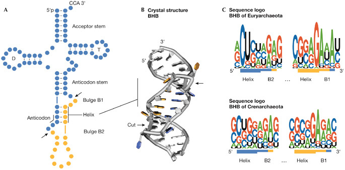
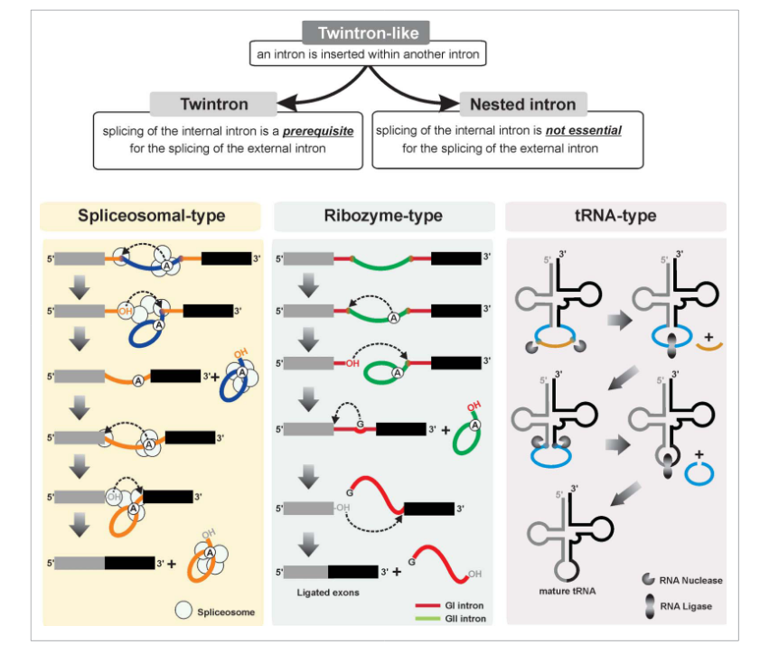
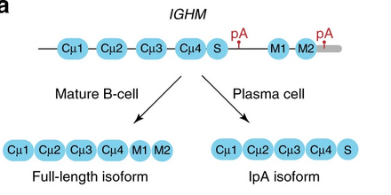
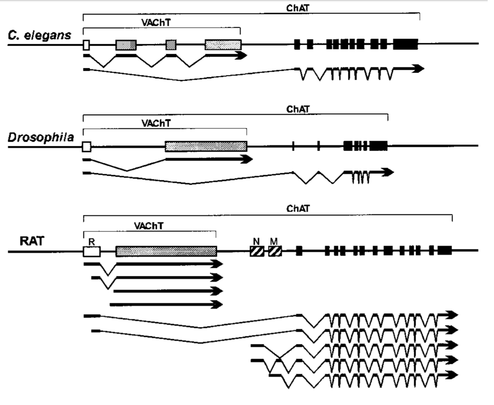
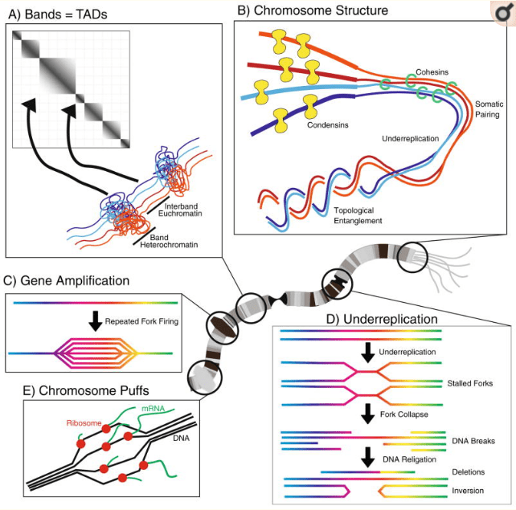

# oddgenes

A list of weird gene annotations or things that break bioinformatics assumptions

See also https://github.com/cmdcolin/oddbiology/ for more weird bio

## Gene structures

### 1bp length exon

Evidence given for a 1bp length exon in Arabidopsis and different splicing
models are discussed

http://www.nature.com/articles/srep18087

Another 1bp exon is discussed here
https://journals.plos.org/plosone/article?id=10.1371/journal.pone.0177959

Microexons in general are an interesting topic and are "involved in important
biological processes in brain development and human cancers" (ref
https://www.cell.com/molecular-therapy-family/nucleic-acids/fulltext/S2162-2531(23)00013-6)
yet are commonly misannotated (e.g. in plants
https://www.nature.com/articles/s41467-022-28449-8)

See also cryptic splicing

### 0bp length exon

The phenomenon of recursive splicing can remove sequences progressively inside
an intron, so there can exist "0bp exons" that are just the splice-site
sequences pasted together.

"To identify potential zero nucleotide exon-type ratchet points, we parsed the
RNA-Seq alignments to identify novel splice junctions where the reads mapped to
an annotated 5' splice site and an unannotated 3' splice site, and the genomic
sequence at the 3' splice site junction was AG/GT"

https://www.ncbi.nlm.nih.gov/pmc/articles/PMC4529404/

### Very large introns

Satellite DNA study uncovers megabase scale introns
https://www.biorxiv.org/content/early/2018/12/11/493254

An example in this paper kl-3 spans 4.3 million bp

In human, an example is Dystrophin. "Dystrophin is coded for by the DMD gene –
the largest known human gene, covering 2.4 megabases (0.08% of the human genome)
at locus Xp21. The primary transcript in muscle measures about 2,100 kilobases
and takes 16 hours to transcribe; the mature mRNA measures 14.0 kilobases"
https://en.wikipedia.org/wiki/Dystrophin

Note: these large introns require very large amounts of DNA to be transcribed
into RNA, before just removing most of the transcribed RNA via intron splicing,
which is sort of "wasteful" on a molecular level

### Small introns

"A 2015 study suggests that the shortest known metazoan intron length is 30 base
pairs (bp) belonging to the human MST1L gene
(https://www.ncbi.nlm.nih.gov/pmc/articles/PMC4675715/). The shortest known
introns belong to the heterotrich ciliates, such as Stentor coeruleus, in which
most (> 95%) introns are 15 or 16 bp long
(https://www.ncbi.nlm.nih.gov/pmc/articles/PMC5659724/)"
https://en.wikipedia.org/wiki/Intron#Distribution

A novel splicing factor may be involved in small introns
https://www.news-medical.net/news/20240215/Novel-splicing-mechanism-for-short-introns-discovered.aspx

### Very large proteins

An algae published about in 2024 encodes a protein PKZILLA-1 that has a mass of
4.7 megadaltons and contains 140 enzyme domains
https://cen.acs.org/biological-chemistry/PKZILLA-proteins-smash-protein-size/102/web/2024/08

In human the TITIN gene (in muscle) has almost 4 megadaltons


The DMD gene above, despite being large on the genome, only encodes a 70
kilo-dalton protein (not megadalton!)
https://pmc.ncbi.nlm.nih.gov/articles/PMC49288/

### Backsplicing and circRNAs

The process of "backsplicing" circularizes RNAs. There can be alternative
backsplicing too

See https://academic.oup.com/nar/article/48/4/1779/5715065

### Very large number of isoforms in Dscam

"Dscam has 24 exons; exon 4 has 12 variants, exon 6 has 48 variants, exon 9 has
33 variants, and exon 17 has two variants. The combination of exons 4, 6, and 9
leads to 19,008 possible isoforms with different extracellular domains (due to
differences in Ig2, Ig3 and Ig4). With two different transmembrane domains from
exon 17, the total possible protein products could reach 38,016 isoforms"

Ref https://en.wikipedia.org/wiki/DSCAM
https://www.wikigenes.org/e/gene/e/35652.html

### Translational frameshift/Ribosomal frameshift/Programmed ribosomal frameshift

Ref https://en.wikipedia.org/wiki/Translational_frameshift

https://www.sciencedirect.com/topics/neuroscience/ribosomal-frameshifting

SARS-CoV-2 uses ribosomal frameshifting and this video shows a 3D animation of
the process, showing a 'pseudoknot' in the RNA contributes to it
https://www.youtube.com/watch?v=gLcueW61QMU

Another lecture explaining frameshift in viruses
https://youtu.be/b5BX5A3dGUQ?t=2980

### Ribosome hopping

"Ribosome hopping involves ribosomes skipping over large portions of an mRNA
without translating them" Ref https://pubmed.ncbi.nlm.nih.gov/24711422/

### Internal Ribosome Entry Sites (IRES)

"Eukaryotic mRNAs are typically monocistronic and translated only a single Open
Reading Frame. Some viruses can reinititate translation after translation
termination using an IRES" Ref
https://en.wikipedia.org/wiki/Internal_ribosome_entry_site

### Stop codon readthrough/translational readthrough

"Stop codon suppression or translational readthrough occurs when in translation
a stop codon is interpreted as a sense codon, that is, when a (standard) amino
acid is 'encoded' by the stop codon. Mutated tRNAs can be the cause of
readthrough, but also certain nucleotide motifs close to the stop codon.
Translational readthrough is very common in viruses and bacteria, and has also
been found as a gene regulatory principle in humans, yeasts, bacteria and
drosophila.[28][29] This kind of endogenous translational readthrough
constitutes a variation of the genetic code, because a stop codon codes for an
amino acid. In the case of human malate dehydrogenase, the stop codon is read
through with a frequency of about 4%.[30] The amino acid inserted at the stop
codon depends on the identity of the stop codon itself: Gln, Tyr, and Lys have
been found for the UAA and UAG codons, while Cys, Trp, and Arg for the UGA codon
have been identified by mass spectrometry.[31] Extent of readthrough in mammals
have widely variable extents, and can broadly diversify the proteome and affect
cancer progression.[32] "

https://en.wikipedia.org/wiki/Stop_codon#Translational_readthrough

### Stop codon re-assignment: selenocysteine

The amino acid Selenocysteine is coded for by a "opal" (UGA) stop codon
(https://en.wikipedia.org/wiki/Selenocysteine)

Is present in all domains of life including humans

As of 2021, 136 human proteins (in 37 families) are known to contain
selenocysteine

Selenocysteine can be coded via a SECIS sequence
https://en.wikipedia.org/wiki/SECIS_element and resulting products are called
([selenoproteins](https://en.wikipedia.org/wiki/Selenoprotein))

### Stop codon re-assignment: pyrrolysine

Pyrrolysine also is coded for by the "amber" (UAG) stop codon
(https://en.wikipedia.org/wiki/Pyrrolysine), not present in humans

"It is encoded in mRNA by the UAG codon, which in most organisms is the 'amber'
stop codon. This requires only the presence of the pylT gene, which encodes an
unusual transfer RNA (tRNA) with a CUA anticodon, and the pylS gene, which
encodes a class II aminoacyl-tRNA synthetase that charges the pylT-derived tRNA
with pyrrolysine. "

There are several other stop codon modifications described here
https://www.nature.com/articles/nrg3963

### Stop codons can also be removed by RNA editing

as in the case of mammalian apoliprotein B, B100 isoform.

"A posttranscriptional modification of the apoB mRNA by conversion of cytidine
into uridine at nucleotide position 6666 changes the genomically encoded
glutamine codon CAA at amino acid residue 2153 into a translational stop codon
UAA."

https://pubmed.ncbi.nlm.nih.gov/8409768/

### Stop codons can be added by polyadenylation

There is a stop codon not in the genome, but one is added post-transcriptionally
by polyadenylation

Noted in vertebrate mitochondrial section here
https://www.ncbi.nlm.nih.gov/Taxonomy/Utils/wprintgc.cgi#SG2

### Ciliates with "No stop codons"

"Flexibility in the nuclear genetic code has been demonstrated in ciliates that
reassign standard stop codons to amino acids...Surprisingly, in two of these
species, we find efficient translation of all 64 codons as standard amino acids
and recognition of either one or all three stop codons"

Termination is therefore "context dependent" rather than a specific 3 letter
sequence https://pubmed.ncbi.nlm.nih.gov/27426948/

### Readthrough transcription

See also this Ensembl blog on annotating readthrough transcription which joins
multiple genes
http://www.ensembl.info/2019/02/11/annotating-readthrough-transcription-in-ensembl/

RNA-seq often makes extremely compelling cases for two-or-more different genes
to be conjoined by splicing

Some algorithms e.g. mikado
https://academic.oup.com/gigascience/article/7/8/giy093/5057872 try to avoid
this calling it artifactual fusion/chimera that can be due to some tandem
duplication but it does seem to be very prevalent in real data sets

### Non-canonical splice sites

The standard splice site recognition sequence is an GU in RNA (or GT in DNA) on
the 5' end and AG on the 3' (remember, goes 5' to 3'). This recognition motif
accounts for the large majority of splicing. If a different sequence is used it
is said that a different spliceosome complex is being used "minor spliceosome"

https://en.wikipedia.org/wiki/Minor_spliceosome

### Cryptic splice sites

Some exons harbor internal splice sites (e.g. they get split) that might be
unused or underused and are so called "cryptic splice sites"

Review article https://academic.oup.com/nar/article/39/14/5837/1382796

The snaptron project from Ben Langmead analyzed huge amounts of RNA-seq public
data and found many types of these cryptic splicing http://snaptron.cs.jhu.edu/

### Wobble splicing

NAGNAG, GYNGYN, repeats of the splicing signal cause modified transcriptional
behavior

"Another mechanism introducing small variations to protein isoforms is wobble
splicing. Here, a GYN repeat at the donor splice site (5’ splice site; Y stands
for C or T and N stands for A, C, G, or T) or an NAG repeat at the acceptor
splice site (3’ splice site) leads to subtle length variations in the spliced
transcripts and finally to alternative isoforms differing in few amino acids."
ref https://onlinelibrary.wiley.com/doi/full/10.1002/bies.201900066?af=R

### Intron retention

Intron retention (IR) is a phenomenon where intron sequence is preserved, or
doesn't get spliced out, in mature RNA

It can occur in both abnormal and normal biological conditions. Transcript with
IR often undergo nonsense-mediated decay.

### Self-splicing RNA

Normally RNA is spliced by a specialized protein complex called a spliceosome.
There is also self-splicing RNA where the splicing is done itself with RNA

The Group 1 intron type mentioned above is a "self splicing" function of RNA not
requiring external spliceosome
https://en.wikipedia.org/wiki/Group_I_catalytic_intron

Group 2 and group 3 with similar but different mechanisms also exist

### Bulge helix bulge introns (archael tRNA)

There are some small intron types called "bulge-helix-bulge" in archaea (and
other organisms)



From https://www.embopress.org/doi/full/10.1038/embor.2008.101

The figure above shows that the orange part is excised as an intron for the tRNA

### Twintron

A twintron is essentially an intron-within-an-intron, and has similar qualities
to the 0bp splicing mentioned above. A twintron may be defined as one where the
internal intron has to be spliced first before the outer one is (may be referred
to as a nested intron if internal is not necessary to be spliced out before the
next)

See https://en.wikipedia.org/wiki/Twintron



Figure from https://doi.org/10.1080/15476286.2015.1103427 showing twintron
conformations with a) spliceosome type introns (the spliceosome is a protein
complex that performs splicing) b) ribosomal type introns (e.g. self splicing
RNA) and c) tRNA/bulge helix bulge type introns

### Introns in viruses

Introns were actually first discovered in viruses before eukaryotes, and the
wikipedia article on introns details this

https://en.wikipedia.org/wiki/Intron#Discovery_and_etymology (see also
https://www.proquest.com/docview/303935681/)

### Nuclear mitochondrial (NUMT) insertions

Pieces of the mitochondrial genome can be inserted into the autosomes in
eukaryotes

https://en.wikipedia.org/wiki/Nuclear_mitochondrial_DNA_segment

### Codon tables

Many eukaryotes use the "standard genetic code" for changing codons to amino
acids but frequent changes occur across the domains of life. The NCBI "genetic
code" table lists several of these and contains recent additions for particular
species

https://www.ncbi.nlm.nih.gov/Taxonomy/Utils/wprintgc.cgi#SG31

One article explains how alternative genetic codes work
https://www.ncbi.nlm.nih.gov/pmc/articles/PMC6207430/

### Untranslated regions

The 5' and 3' UTR (un-translated region) is a part of the pre-mRNA at the start
and end of the gene respectively that is spliced away in the mature RNA

This blog post by Ensembl shows how they annotate UTR and 19kb 3' UTR in Grin2b
http://www.ensembl.info/2018/08/17/ensembl-insights-how-are-utrs-annotated/

They have many important functionality and are often targets of miRNA binding
which leads to degradation.

### Polyadenylation

Polyadenylation is the addition of a string of "A"s to the pre-mRNA on the 3'
end of the transcript (the "A"s are not part of the genome). There is a "poly-A
signal" in the genome that is recognized by the "RNA cleavage complex" and after
it is cleaved, the poly-A tail is added
https://en.wikipedia.org/wiki/Polyadenylation

A survey of poly-A using Oxford Nanopore found a transcript isoform with a 450bp
poly-A tail ENST00000581230, with intron retention being a possible correlate of
having a longer poly-A tails
https://www.biorxiv.org/content/early/2018/11/09/459529.article-info

"Intronic polyadenylation" can also occur, which leads to different isoforms
(the wording intronic polyadenylation is maybe a bit odd, but my understanding
is that the "transcription stops" at a poly-A site inside an intron essentially)



Figure showing "intronic polyadenylation" (IpA) creating a different isoform
from https://www.nature.com/articles/s41467-018-04112-z

In mammalian mitochondria, some messages are polyadenylated after a U residue
which is the U in a UAA stop codon -- the post-transcriptional polyadenylation
completes the stop codon

### Circular chromosomes

Circularized chromosomes should be unsurprising to anyone working with plasmids
and many prokaryotic genomes but for gene annotation formats which use linear
coordinates, representing anything wrapping around the origin is challenging.

Many genomic viewers do not do this well. For GFF format this is done by making
the end go past the end of the genome. Below, the genome is 6407 bp in length,
but the CDS feature extends past this and sets Is_circular=true

```
##gff-version 3.2.1
# organism Enterobacteria phage f1
# Note Bacteriophage f1, complete genome.
J02448  GenBank region  1      6407    .       +       .       ID=J02448;Name=J02448;Is_circular=true;
J02448  GenBank CDS     6006   7238    .       +       0       ID=geneII;Name=II;Note=protein II;
```

### Dynamic DNA structures in vivo

The replication of the 2 micron plasmid found in Saccharomyces cerevisiae relies
on a programmed DNA rearrangement; in any population of cells two different
states of the 2 micron plasmid can be expected and these will interconvert in
later generations. Reference: https://pubmed.ncbi.nlm.nih.gov/23541845/

### Overlapping genes

It is possible for gene sequences to overlap, on different strands
(sense-antisense) or same strand, possibly in alternate coding frames

https://en.wikipedia.org/wiki/Overlapping_gene

Some articles

- The novel EHEC gene asa overlaps the TEGT transporter gene in antisense and is
  regulated by NaCl and growth phase
  https://www.ncbi.nlm.nih.gov/m/pubmed/30552341/
- Overlapping genes in natural and engineered genomes
  https://www.nature.com/articles/s41576-021-00417-w
- Uncovering de novo gene birth in yeast using deep transcriptomics
  https://www.nature.com/articles/s41467-021-20911-3

## Flybase

### Chimeric genes

The gene Jingwei is a chimera (or fusion) of two genes, alcohol dehydrogenage
and yellow emperor. Many chimeras are damaging but this has been selected for

http://www.pnas.org/content/101/46/16246

Two Cytochrome P450 genes that don't confer any insecticide resistance on their
own but a chimeric P450 does https://pubmed.ncbi.nlm.nih.gov/22949643/

## Wormbase

### Adding leader sequence to mRNA

"About 70% of C. elegans mRNAs are trans-spliced to one of two 22 nucleotide
spliced leaders. SL1 is used to trim off the 5' ends of pre-mRNAs and replace
them with the SL1 sequence. This processing event is very closely related to
cis-splicing, or intron removal."

The region that is spliced out is called an outron

http://www.wormbook.org/chapters/www_transsplicingoperons/transsplicingoperons.html

### Polycistronic transcripts/operons

Although prevalent in bacteria, operons are not common in eukaryotes. However,
they are common in C. elegans specifically. "A characteristic feature of the
worm genome is the existence of genes organized into operons. These
polycistronic gene clusters contain two or more closely spaced genes, which are
oriented in a head to tail direction. They are transcribed as a single
polycistronic mRNA and separated into individual mRNAs by the process of
trans-splicing"

http://www.wormbook.org/chapters/www_overviewgenestructure.2/genestructure.html

### Trans-splicing of exons on different strands

A pre-mRNA from both strands of DNA eri6 and eri7 are combined to create eri-6/7

Source http://forums.wormbase.org/index.php?topic=1225.0
http://www.ncbi.nlm.nih.gov/pmc/articles/PMC2756026/

### Exon shared across different genes

An example from drosophila, C. elegans, and rat shows a gene with a 5' exon
being shared between two genes



Source http://forums.wormbase.org/index.php?topic=1225.0
https://www.fasebj.org/doi/full/10.1096/fj.00-0313rev

An example here shows 5'UTR exons shared across different olfactory receptor
genes ("Some OR genes share 5'UTR exons")

https://www.biorxiv.org/content/biorxiv/early/2019/09/19/774612.full.pdf

## Evolution

### Possible adaptive bacteria->eukaryote HGT

A possible horizontal gene transfer from bacteria to eukaryotes is found in an
insect that feeds on coffee beans. Changes that the gene had to undergo are
covered (added poly-A tail, shine-dalgarno sequence deleted)

https://www.ncbi.nlm.nih.gov/pmc/articles/PMC3306691/

also https://www.cell.com/cell/fulltext/S0092-8674(19)30097-2

### Transgenerational epigenetic inheritance

This phenomena of epigenetic modifications being passed down across generations
garners a lot of media attention and scientific attention. The idea of it being
influenced by what "one does in life" such as experiencing famine is also very
interesting.

https://en.wikipedia.org/wiki/Transgenerational_epigenetic_inheritance

There are skeptics also
http://www.wiringthebrain.com/2018/07/calibrating-scientific-skepticism-wider.html
but the science is hopefully what speaks for itself

## Codon usage

### Alternative start codons

"The most common start codons for known Escherichia coli genes are AUG (83% of
genes), GUG (14%) and UUG (3%)"

"Here, we systematically quantified translation initiation of green fluorescent
protein (GFP) from all 64 codons and nanoluciferase from 12 codons on plasmids
designed to interrogate a range of translation initiation conditions."

https://www.sciencedaily.com/releases/2017/02/170221080506.htm

Testing in eukaryotes has also revealed alternative starts being viable
https://en.wikipedia.org/wiki/Start_codon#Eukaryotes

## Molecular

### 4-base/quaternary/quadruplet codons

3-base codon system is assumed by many, but engineered tRNAs can decode 4-base
codons with potential applications for using amino acids outside the 20
canonical ones

review https://elifesciences.org/articles/78869

evolving improved 4-base efficiency
https://www.nature.com/articles/s41467-021-25948-y

### Complex DNA structures

The standard DNA double stranded helix is called B-DNA

"There are also triple-stranded DNA forms and quadruplex forms such as the
G-quadruplex and the i-motif. "
https://en.wikipedia.org/wiki/Nucleic_acid_double_helix

### Triplex DNA

https://en.wikipedia.org/wiki/Triple-stranded_DNA

### Polytene chromosome

Some organisms, famously insects in their salivary glands, create many copies of
genes through multiple phases of incomplete DNA replication
https://en.wikipedia.org/wiki/Polytene_chromosome



Figure source https://www.ncbi.nlm.nih.gov/pmc/articles/PMC5768140/

"Polytene chromosomes are produced by endoreplication, in which chromosomal DNA
undergoes mitotic replication, but the strands do not separate. Ten rounds of
endoreplication produces 2^10 = 1,024 DNA strands, which when arranged alongside
of each other produce distinctive banding patterns. Endoreplication occurs in
cells of the larval salivary glands of many species of Diptera, and increases
production of mRNA for Glue Protein that the larvae use to anchor themselves to
the walls of (for example) culture vials." from
https://www.mun.ca/biology/scarr/Polytene_Chromosomes.html

### Endoreplication

The above section about polytene chromosomes mentions endoreplication but this
can also affect many other contexts and was mentioned as an issue in genome
assembly of some plants. A talk given about vanilla bean found a lot of
endoreplication during their genome assembly which leads to very uneven
coverage. They tried to select tissue samples that had the least amount of
endoreplication.
https://plan.core-apps.com/pag_2023/abstract/e26dbeb1-df8f-4c57-a062-dcaf881b79f4

### Endo-(poly)ploidy

Different cells may have different numbers of copies of chromosomes and it also
occurs in some human cell types: "polyploid cells can exist in otherwise diploid
organisms (endopolyploidy). In humans, polyploid cells are found in critical
tissues, such as liver and placenta. A general term often used to describe the
generation of polyploid cells is endoreplication, which refers to multiple
genome duplications without intervening division/cytokinesis"
https://www.ncbi.nlm.nih.gov/pmc/articles/PMC4442802/

### Programmed DNA elimination

"While we commonly assume the genome to be largely identical across different
cells of a multicellular organism, a number of species undergo a developmentally
regulated elimination process by which the genome in somatic cells is reduced,
while the germline genome remains intact. This process, called Programmed DNA
Elimination (PDE), affects a number of species including copepod crustaceans,
lamprey fish, single-celled ciliates and nematode worms (though not C.
elegans!)."

From ISMB2023 video "Deciphering developmentally programmed DNA elimination in
Mesorhabditis nematodes" https://www.youtube.com/watch?v=2x6ElKeISRY

See also the term "internal eliminated sequences" (IES)

### Range of ploidy

Wikipedia lists this table with examples of organisms with different ploidy
https://en.wikipedia.org/wiki/Polyploidy#Types

- haploid (one set; 1x), for example male European fire ants
- diploid (two sets; 2x), for example humans
- triploid (three sets; 3x), for example sterile saffron crocus, or seedless
  watermelons, also common in the phylum Tardigrada[7]
- tetraploid (four sets; 4x), for example, Plains viscacha rat, Salmonidae
  fish,[8] the cotton Gossypium hirsutum[9]
- pentaploid (five sets; 5x), for example Kenai Birch (Betula kenaica)
- hexaploid (six sets; 6x), for example some species of wheat,[10] kiwifruit[11]
- heptaploid or septaploid (seven sets; 7x)
- octaploid or octoploid, (eight sets; 8x), for example Acipenser (genus of
  sturgeon fish), dahlias
- decaploid (ten sets; 10x), for example certain strawberries
- dodecaploid or duodecaploid (twelve sets; 12x), for example the plants Celosia
  argentea and Spartina anglica [12] or the amphibian Xenopus ruwenzoriensis.
- tetratetracontaploid (forty-four sets; 44x), for example black mulberry[13]

### DNA modifications

There are many chemical modifications that can happen to DNA, leading to an
"extended alphabet" with functional changes.

A common DNA modification is called methylation. The most common is a 5mC
modification, a methylation of the letter C, and is mostly found in a CpG (a C
followed by a G in the genome)

Many other modifications exist, see https://dnamod.hoffmanlab.org/

## RNA world

### RNA modifications

https://www.hindawi.com/journals/jna/2011/408053/tab1/

updated link on hindawi should point here http://mods.rna.albany.edu/mods/ (this
link now dead too, see maybe http://genesilico.pl/modomics/modifications)

### RNA editing

RNA editing is a post-transcriptional modification to the mRNA, which can change
what we would see when the RNA is sequenced. A-to-I editing is common in some
species, which would make the RNA, when sequenced, appear to have a G instead of
an A. If the genome was sequenced, it would not show a SNP but the RNA-seq would
appear to have A->G.

RNA editing can be conditional; mammalian apolipoprotein B is synthesized as a
48 kilodalton form or a 100 kilodalton form; the latter is created by editing
out a stop codon to enable read through

Other editing occurs also https://en.wikipedia.org/wiki/RNA_editing

Editing in some ciliate mitochondria adds information to messages and can
increase the length of the final message by over 2-fold.

### Post-Transcriptional Exon Shuffling (PTES)

While the exon structure of most mRNAs follows the linear sequence of the
transcribed DNA, there are a few cases where mature mRNAs contain exons in a
non-linear order.

Al-Balool and Weber _et al_ (2011) validated several cases of PTES in human
genes that are evolutionarily conserved, including _MAN1A2_, _PHC3_, _TLE4_, and
_CDK13_: https://genome.cshlp.org/content/21/11/1788.short

### Maternal RNAs being passed down

Maternal RNAs can show activity in the zygote (e.g.
https://en.wikipedia.org/wiki/Maternal_to_zygotic_transition) which can lead to
complex transgenerational effects

### Lowly expressed RNA has large effects

A lncRNA VELUCT almost flies under the radar in a lung cancer screen due to
being very lowly expressed such that it is "below the detection limit in total
RNA from NCI-H460 cells by RT-qPCR as well as RNA-Seq", however this study
confirms it as a factor in experiments

https://www.ncbi.nlm.nih.gov/pubmed/28160600?dopt=Abstract

Note that X inactivation relies on relatively lowly expressed RNA also
https://twitter.com/mitchguttman/status/1454256452990734336

### X chromosome inactivation

X chromosome inactivation is produced by a non-coding transcript called Xist
that is transcribed on the X that is being inactivated. The Xist transcript
"coats" the X chromosome with itself. An anti-sense transcript called Tsix
regulates Xist

https://en.wikipedia.org/wiki/XIST

https://en.wikipedia.org/wiki/X-inactivation#Xist_and_Tsix_RNAs

https://www.youtube.com/watch?v=y3ST0whbA4k (great series from iBiology on X
chromosome inactivation)

### Types of RNA

There are many types of RNA some more weird an exotic than others, a large list
https://en.wikipedia.org/wiki/List_of_RNAs

Some are named based on where they are expressed or active

Others are uniquely shaped. There are also circular RNA for example
https://en.wikipedia.org/wiki/Circular_RNA

Small and long non coding RNAs often fold into important structural shapes

## Proteins

### Removal of start amino acid in proteins

This is probably obvious to many people who work on proteins but while the
genome has almost all genes starting with a start codon which produces
methionine, this is often post translationally removed
https://en.m.wikipedia.org/wiki/Methionyl_aminopeptidase

### Inteins

An intein is like an intron but for a protein, a segment of protein that is
spliced out https://en.wikipedia.org/wiki/Intein

See section here
https://github.com/The-Sequence-Ontology/Specifications/blob/master/gff3.md#pathological-cases

### Polyprotein

Viral sequences can create a polyprotein which is fully transcribed and
translated before being cleaved by a protease. In some viruses (such as
coronaviruses) their translation involves ribosomal frameshifting.

Dengue, HIV, flu, etc. use this

https://www.ncbi.nlm.nih.gov/pmc/articles/PMC6040172/
https://www.sciencedirect.com/science/article/abs/pii/S0959440X15000597

### Interesting PDB entries

From another repo
https://github.com/molstar/molstar/blob/master/docs/docs/misc/interesting-pdb-entries.md

## Transposons

### Cross-species BovB transposon transfers

Or "How a quarter of the cow genome came from snakes"
http://phenomena.nationalgeographic.com/2013/01/01/how-a-quarter-of-the-cow-genome-came-from-snakes/

Source http://www.pnas.org/content/110/3/1012.full

### LINE1 important for embryonic development

Transposon activity can mutate DNA as it will insert itself into the genome. The
genome has functions for keeping transposons inactive. However, evidence shows
that the LINE1 is important for embryonic development.

https://www.ucsf.edu/news/2018/06/410781/not-junk-jumping-gene-critical-early-embryo

## Immunity

### VDJ Recombination

VDJ recombination is a process of somatic recombination that is done in immune
cells. It recognizes certain "recombination signal sequences". Different gene
segments of class "V", class "D", and class "J" exons (sometimes the exons are
referred to as "genes" themselves in literature) are somatically rearranged into
coherent genes that are then transcribed to create immune diversity. Splicing at
the DNA level is not precise, with terminal transferase adding random
nucleotides to further diversify the sequences

https://en.wikipedia.org/wiki/V(D)J_recombination

### MHC region

The MHC region is a very polymorphic region of the genome on chr6. I'm not
personally familiar with all the intricacies of MHC beyond that it is a unique
contributor of some additional hg38 alternative loci/contigs due to it's high
diversity

- https://en.wikipedia.org/wiki/Major_histocompatibility_complex

- https://en.wikipedia.org/wiki/Human_leukocyte_antigen

## Structural variations

### Tandem duplication

A tandem duplication can be seen as a piece of DNA that copied side by side in
the genome. But why would this occur?

Some biological factors can include

- replication slippage
- retrotransposition
- unequal crossing over (UCO).
- imperfect repair of double-strand breaks by nonhomologous end joining (NHEJ)
  (specifically generates 1-100bp range indels according to article)

Ref https://academic.oup.com/mbe/article/24/5/1190/1038942

## Pseudogenes

### A pseudogene that can protect against cancer in Elephants

The LIF gene has many copies in Elephant but many are non-functional. One copy
can be "turned back on" and play a role in cancer protection. They call this a
"zombie gene"

https://www.cell.com/cell-reports/fulltext/S2211-1247(18)31145-8

https://www.sciencealert.com/lif6-pseudogene-elephant-tumour-suppression-solution-petos-paradox

## Regulation

### Intron mediated enhancement (IME)

It has been shown that some intron sequences can enhance expression similar to
how promoter sequences work
https://en.wikipedia.org/wiki/Intron-mediated_enhancement

The first intron of the UBQ10 gene in Arabidopsis exhibits IME, and "the
sequences responsible for increasing mRNA accumulation are redundant and
dispersed throughout the UBQ10 intron"
http://www.plantcell.org/content/early/2017/04/03/tpc.17.00020.full.pdf+html

The classic peppered moth phenotype is a intron TE insertion
https://www.nature.com/articles/nature17951 (may not be strictly IME, I'm
personally not sure)

### Bidirectional promoters

Wikipedia
https://en.wikipedia.org/wiki/Promoter_(genetics)#Bidirectional_(mammalian)

"Bidirectional promoters are a common feature of mammalian genomes. About 11% of
human genes are bidirectionally paired."

"The two genes are often functionally related, and modification of their shared
promoter region allows them to be co-regulated and thus co-expressed"

## Chromosomal abnormalities

### Uniparental disomy (UPD)

A child can inherit both copies of the genome from one parent, instead of the
"usual" one copy from mom, one from dad

"UPD arises usually from the failure of the two members of a chromosome pair to
separate properly into two daughter cells during meiosis in the parent’s
germline (nondisjunction). The resulting abnormal gametes contain either two
copies of a chromosome (disomic) or no copy of that chromosome (nullisomic),
instead of the normal single copy of each chromosome (haploid). This leads to a
conception with either three copies of one chromosome (trisomy) or a single copy
of a chromosome (monosomy). If a second event occurs by either the loss of one
of the extra chromosomes in a trisomy or the duplication of the single
chromosome in a monosomy, the karyotypically normal cell may have a growth
advantage as compared to the aneuploid cells. UPD results primarily from one of
these “rescue” events"

https://www.ncbi.nlm.nih.gov/pmc/articles/PMC3111049/

### Mosaic loss of Y chromosome

Older men can have a mosaic loss of the Y chromosome
https://en.wikipedia.org/wiki/Mosaic_loss_of_chromosome_Y

https://www.karger.com/Article/FullText/508564 (found from
https://www.biostars.org/p/9482437/)

may be associated with cardiac issues
https://www.science.org/doi/10.1126/science.abn3100

### Mosaic loss of X chromosome

Similar to the above but for X
https://www.cancer.gov/news-events/press-releases/2024/genetic-factors-predict-x-chromosome-loss

### Ring chromosome

In organisms with normally linear chromosomes, circular or "ring" chromosomes
can form from aberrant processes https://en.wikipedia.org/wiki/Ring_chromosome


There are also smaller fragments that can be circularized called "supernumerary
small ring chromosomes" (sSRC) or their normal linear part, "supernumary small
marker chromosomes" (sSMC)
https://en.wikipedia.org/wiki/Small_supernumerary_marker_chromosome

## File formats

### Non-ACGT letters in fasta files

The latest human genome, for example, downloaded from NCBI, contains a number of
Non-ACGT letters in the form of IUPAC codes
https://www.bioinformatics.org/sms/iupac.html These represent ambiguous bases.

Here is the incidence of non-ACGTN IUPAC letters in the entire human genome
GRCh38.p14 from
https://ftp.ncbi.nlm.nih.gov/refseq/H_sapiens/annotation/GRCh38_latest/refseq_identifiers/GRCh38_latest_genomic.fna.gz
(same for the "analysis set" files in
https://ftp.ncbi.nlm.nih.gov/genomes/all/GCA/000/001/405/GCA_000001405.15_GRCh38/seqs_for_alignment_pipelines.ucsc_ids/)

```
{
  'B' => 2,
  'K' => 8,
  'Y' => 36,
  'M' => 8,
  'R' => 29,
  'W' => 15,
  'S' => 5
};
```

Did you expect that in your bioinformatics software? Note that the mouse genome
(GRCm38.p5) as far as I could tell does not contain any non-ACGT IUPAC letters

See [count_fasta_letters.pl](count_fasta_letters.pl) for a script to count this.
The UCSC hg38.fa.gz does not have any non-ACGTN letters.

### rs SNP identifiers occurring in multiple places

Due to how dbSNP is created (based on alignments), an rs ID can occur in
multiple places on the genome https://www.biostars.org/p/2323/

### Weird characters in FASTA sequence names

In response to hg38 including a colon in sequence names, which conflicts with
commonly used representation of a range as chr1:1-100 for example (note:
SAMv1.pdf contains a regex to help resolve this), people analyzed meta-character
frequencies in sequence names https://github.com/samtools/hts-specs/issues/291

```
ENA
#   16927
*   1
,   231
-   122563947
.   521540419
/   236951
\   0
:   30181
;   72892
=   186611
@   3713
|   949

Broad(?)
     12 #
    527 *
    357 ,
1451132 -
1492749 .
  86114 /
 233731 :
   2034 =
     17 @
1735713 |

Reference sequences
 # 203
 % 203
 * 525
 + 1
 , 496
 - 154226
 . 1826561
 : 1577
 = 26
 _ 4961932
 | 1098333
```

Note that commas in FASTA names is being suggested as an illegal character
because of the supplementary alignment tag in SAM/BAM using comma separated
values

## Humongous chromosomes V1

Genomes such as wheat have large chromosomes averaging 806Mbp but the BAI/TBI
file formats are limited to 2^29-1 ~ 536Mbp in size (this is due to the binning
strategy, the max bin size is listed as 2^29). The CSI index format was created
to help index BAM and tabix files with large chromosomes.

Bonus: I made a web tool to help visualize BAI files to show how the binning
index works https://cmdcolin.github.io/bam_index_visualizer/

## Humongous chromosomes V2

The axolotl genome has individual chromosomes that are of size 3.14 Gbp
https://genome.cshlp.org/content/29/2/317.long (2019) which is almost as big as
the entire human genome

The BAM and CRAM formats can only store 2^31-1 (~2.14Gbp) length chromosomes
however so bgzip/tabix SAM is used (discussion
https://github.com/samtools/hts-specs/issues/655)

## Largest genomes

Just some honorable mentions for largest genome

- Polychaos dubium/Amoeba dubium/Chaos chaos - ~600-1300Gbp (unsequenced, 1968
  back of envelope measurement, needs confirmation)
  https://en.wikipedia.org/wiki/Polychaos_dubium (another ref
  https://bionumbers.hms.harvard.edu/bionumber.aspx?&id=117342)
- Dinoflagellates - up to 250Gbp (unsequenced, 1987 book referenced in this
  paper, needs confirmation, has weird chromosome "rod-like" structures)
  https://www.nature.com/articles/s41588-021-00841-y
- Tmesipteris oblanceolata (fork fern) - ~160Gb (unsequenced)
  https://www.nature.com/articles/d41586-024-01567-7
- Paris japonica (canopy plant) - ~149Gbp (unsequenced)
  https://en.wikipedia.org/wiki/Paris_japonica
- Tmesipteris_obliqua (fern) - ~147Gbp (unsequenced) -
  https://en.wikipedia.org/wiki/Tmesipteris_obliqua
- South American lungfishes (Lepidosiren paradoxa) - ~91Gbp (sequenced)
  https://www.nature.com/articles/s41586-024-07830-1
- European mistletoe - ~90Gbp (sequenced)
  https://www.darwintreeoflife.org/news_item/2022-the-year-we-built-the-biggest-genome-in-britain-and-ireland/
- Antarctic krill - ~48Gbp (sequenced)
  https://www.cell.com/cell/pdf/S0092-8674(23)00107-1.pdf
- Neoceratodus forsteri (Australian lungfish) - ~43Gbp (sequenced)
  https://www.smithsonianmag.com/smart-news/australian-lungfish-has-biggest-genome-ever-sequenced-180976837/
  https://www.ncbi.nlm.nih.gov/genome/?term=Neoceratodus+forsteri
- Ambystoma mexicanum (axolotl) - ~32Gbp (sequenced)
  https://en.wikipedia.org/wiki/Axolotl
  https://www.ncbi.nlm.nih.gov/genome/?term=axolotl
- Allium ursinum (wild garlic) - ~30gb https://en.wikipedia.org/wiki/Onion_Test
- Coastal redwood - ~26Gbp (sequenced)
  https://www.ucdavis.edu/climate/news/coast-redwood-and-sequoia-genome-sequences-completed
  https://www.ncbi.nlm.nih.gov/genome/?term=redwood
- Loblolly pine - ~22Gbp (sequenced)
  https://blogs.biomedcentral.com/on-biology/wp-content/uploads/sites/5/2014/03/genomelog030.jpg
  https://www.ncbi.nlm.nih.gov/genome/?term=loblolly+pine
- Wheat genome - ~17Gbp
  https://academic.oup.com/gigascience/article/6/11/gix097/4561661
  https://www.ncbi.nlm.nih.gov/genome/?term=wheat

Inspired by twitter thread
https://twitter.com/PetrovADmitri/status/1506824610360168455

Also see http://www.genomesize.com/statistics.php?stats=entire#stats_top

See also the plant C-value database, which is a measurement you will sometimes
see instead of base pair length https://cvalues.science.kew.org/ ("C-value is
the amount, in picograms, of DNA contained within a haploid nucleus")

## Humongous CIGAR strings

The CG tag was invented in order to store CIGAR strings longer than 64k
operations, since n_cigar_opt is a uint16 in BAM. The CIGAR string is relevant
only for BAM files, CRAM uses a different storage mechanism for CIGAR type data
(e.g. the reference based compression).

## Interesting gene names

## Update Dec 2023

I extracted all the genes from a number of model organism databases here
https://cmdcolin.github.io/genes/

Here are some random highlights from earlier work

- Tinman - "In mutant or knockout organisms, the loss of tinman results in the
  lack of heart formation" https://en.wikipedia.org/wiki/Tinman_gene
- Sonic hedgehog (SHH) - SHH mutants have 'spiky' fruit fly embryos
  https://en.wikipedia.org/wiki/Sonic_hedgehog
- Robotnikin - antagonist of SHH, villain of the sonic hedgehog franchise -
  https://pmc.ncbi.nlm.nih.gov/articles/PMC2770933/
- Heart of glass (heg) - a zebrafish gene with mutant phenotype "Individual heg
  myocardial cells are also thinner than wild-type"
  https://www.ncbi.nlm.nih.gov/pubmed/14680629
- Dracula (drc) - "we isolated a mutation, dracula (drc), which manifested as a
  light-dependent lysis of red blood cells"
  https://www.ncbi.nlm.nih.gov/pubmed/10985389 (now renamed
  https://zfin.org/ZDB-GENE-000928-1)
- Sleeping Beauty transposon system -
  https://en.wikipedia.org/wiki/Sleeping_Beauty_transposon_system
- Skywalker (sky) -
  https://www.ncbi.nlm.nih.gov/gene?Db=gene&Cmd=DetailsSearch&Term=35359
- TIME FOR COFFEE (TIC) - "We characterize the time for coffee (tic) mutant that
  disrupts circadian gating, photoperiodism, and multiple circadian rhythms,
  with differential effects among rhythms"
  https://www.ncbi.nlm.nih.gov/gene?Db=gene&Cmd=DetailsSearch&Term=821807
- WTF - "Some alleles of the wtf gene family can increase their chances of
  spreading by using poisons to kill other alleles, and antidotes to save
  themselves." - https://www.ebi.ac.uk/interpro/entry/IPR004982
  https://www.sciencedaily.com/releases/2017/06/170620093209.htm
- Mothers against decapentaplegic - "it was found that a mutation in the gene in
  the mother repressed the gene decapentaplegic in the embryo. The phrase
  "Mothers against" was added as a humorous take-off"
  https://en.wikipedia.org/wiki/Mothers_against_decapentaplegic
- Saxophone (sax) - http://www.sdbonline.org/sites/fly/gene/saxophon.htm
- Beethovan (btv) - http://www.uniprot.org/uniprot/Q0E8P6
- Superman+kryptonite - https://en.wikipedia.org/wiki/Superman_(gene)
- Supervillin (SVIL) - https://www.uniprot.org/uniprot/O95425
- Wishful thinking (wit) - https://www.wikigenes.org/e/gene/e/44096.html
- Doublesex (dsx) - "The gene is expressed in both male and female flies and is
  subject to alternative splicing, producing the protein isoforms dsx_f in
  females and the longer dsx_m in males."
  https://en.wikipedia.org/wiki/Doublesex
- Fruitless (fru) - "Early work refers to the gene as fruity, an apparent pun on
  both the common name of D. melanogaster, the fruit fly, as well as a slang
  word for homosexual. As social attitudes towards homosexuality changed, fruity
  came to be regarded as offensive, or at best, not politically correct. Thus,
  the gene was re-dubbed fruitless, alluding to the lack of offspring produced
  by flies with the mutation.[10] However, despite the original name and a
  continuing history of misleading inferences by the popular media, fruitless
  mutants primarily show defects in male-female courtship, though certain
  mutants cause male-male or female-female courtship.[11]"
  https://en.wikipedia.org/wiki/Fruitless_(gene)
- Transformer (tra) - https://en.wikipedia.org/wiki/Transformer_(gene)
- Gypsy+Flamenco - https://www.ncbi.nlm.nih.gov/pmc/articles/PMC1206375/ also
  described in wiki
  https://en.wikipedia.org/wiki/Piwi-interacting_RNA#History_and_loci
- Jockey - http://flybase.org/reports/FBgn0015952.html
- Tigger - https://www.omim.org/entry/612972
- Nanog - celtic legend
  https://www.sciencedaily.com/releases/2003/06/030602024530.htm (source
  https://twitter.com/EpgntxEinstein/status/1057359656220348417)
- Jerky (jrk) - "A deficit in the Jerky protein in mice causes recurrent
  seizures" https://www.genecards.org/cgi-bin/carddisp.pl?gene=JRK
- Hippo (Hpo) - https://www.wikigenes.org/e/gene/e/37247.html
- Dishevelled (Dsh) - https://en.wikipedia.org/wiki/Dishevelled
- Glass bottom boat (gbb) - "fruit fly larvae with a faulty glass bottom boat
  gene are transparent"
  https://www.thenakedscientists.com/articles/interviews/gene-month-glass-bottom-boat
  http://www.sdbonline.org/sites/fly/dbzhnsky/60a-1.htm
- Makes caterpillars floppy (mcf) - https://www.pnas.org/content/99/16/10742
  (source https://twitter.com/JUNIUS_64/status/1081007886560608256)
- Eyeless http://flybase.org/reports/FBgn0005558.html
- Straightjaket (stj) - http://flybase.org/reports/FBgn0261041.html
- Huluwa http://science.sciencemag.org/content/362/6417/eaat1045 ref
  https://twitter.com/zhouwanding/status/1065960714978897921
- frameshifts or pseudogene? - check sequence -
  https://www.ncbi.nlm.nih.gov/gene/?term=24562233%5Buid%5D
- Bad response to refrigeration (brr)
  https://twitter.com/hitenmadhani/status/1149471071675924481?s=20
- Mindbomb (mib1) - https://www.sdbonline.org/sites/fly/hjmuller/mindbomb1.htm
- β'COP http://flybase.org/reports/FBgn0025724.html
  (https://twitter.com/DarrenObbard/status/1260613447198412800)
- King-tubby https://www.uniprot.org/uniprot/B0XFQ9 see also tubby
  https://www.uniprot.org/uniprot/P50586
- fucK https://www.uniprot.org/uniprot/?query=fuck&sort=score
- Halloween genes https://en.wikipedia.org/wiki/Halloween_genes
- VANDAL21
  https://www.arabidopsis.org/servlets/TairObject?type=transposon_family&id=139
- HotDog domain - superfamily of genes/proteins
  https://www.wikidata.org/wiki/Q24785143
  https://www.ebi.ac.uk/interpro/entry/IPR029069
- Flower/fwe - https://flybase.org/reports/FBgn0261722.html
- Brahma https://www.sdbonline.org/sites/fly/polycomb/brahma.htm
- Pokemon gene - "The Pokémon Company threatened MSKCC with legal action in
  December 2005 for creating an association between cancer and the media
  franchise, and as a consequence MSKCC is now referring to it by its gene name
  Zbtb7" - Pokemon/pikachu/zubat (story
  https://bsky.app/profile/c0nc0rdance.bsky.social/post/3k6w3gwtell2j)
- Bring lots of money (blom7α)
  https://www.ncbi.nlm.nih.gov/pmc/articles/PMC2781463/
  https://www.uniprot.org/uniprotkb/Q7Z7F0/entry
- MAGOH - Drosophila flies produce unfit progeny when they have mutations in
  their mago nashi (Japanese: 孫なし, Hepburn: mago nashi,
  lit. 'grandchildless') gene. The progeny have defects in germplasm assembly
  and germline development https://www.uniprot.org/uniprotkb/P61326/entry
- IGL@ - a locus containing many immunoglobulin genes, but why the @ sign?
  https://en.wikipedia.org/wiki/IGL@
- Spooky toxin - https://en.wikipedia.org/wiki/Ssm_spooky_toxin
  (https://twitter.com/depthsofwiki/status/1712555421918245242)
- Always early (aly) - http://flybase.org/reports/FBgn0004372.html
- Lonely guy (LOG) - https://onlinelibrary.wiley.com/doi/full/10.1111/pbi.13783
- PKZILLA (very large gene) -
  https://www-science-org.libproxy.berkeley.edu/doi/10.1126/science.ado3290
- Dachshund (dac) "plays a role in leg development" (in flies)
  https://en.wikipedia.org/wiki/Dachshund_(gene)
- Blanks ("Loss of Blanks causes complete male sterility")
  https://www.pnas.org/doi/10.1073/pnas.1009781108
- LUMP (and with a p-element insertion p-lump)
  https://pmc.ncbi.nlm.nih.gov/articles/PMC3166160/
- loquacious
  https://www.ncbi.nlm.nih.gov/gene?Db=gene&Cmd=DetailsSearch&Term=34751

### Allele names

Sometimes it is not the gene, but the allele that is named

- Bad hair day http://www.informatics.jax.org/allele/MGI:3764934
- Samba, chacha, bossa nova http://www.informatics.jax.org/allele/MGI:3708457
- Yoda http://www.informatics.jax.org/allele/MGI:3797584

Ref https://twitter.com/hmdc_mgi/status/1242893531779391496

## More reading

Great illustrations of interesting biology, including information about gene
names https://twitter.com/vividbiology

Many of the stories behind fly gene nomenclature is available at
https://web.archive.org/web/20110716201703/http://www.flynome.com/cgi-bin/search?source=browse
including the famous ForRentApartments dot com gene (just kidding but lol
https://web.archive.org/web/20110716202150/http://www.flynome.com/cgi-bin/search?storyID=180)

Musing article: "What is in a (gene) name?"
https://web.archive.org/web/20180731060319/https://blogs.plos.org/toothandclaw/2012/06/17/whats-in-a-gene-name/

## Send PRs for more things!
