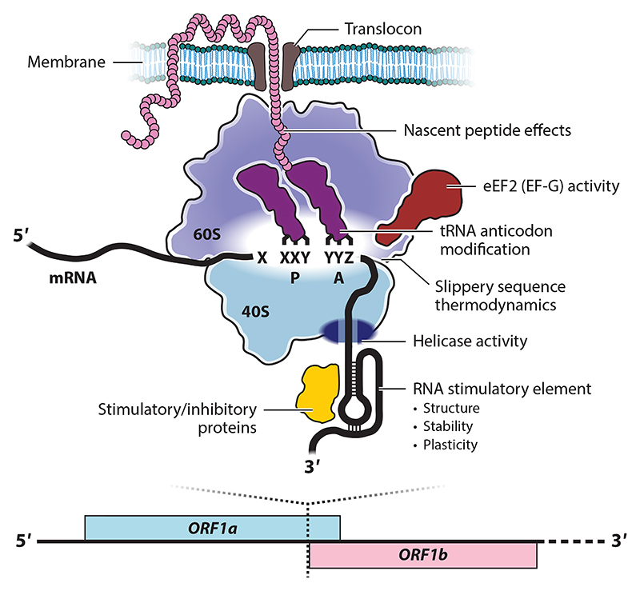
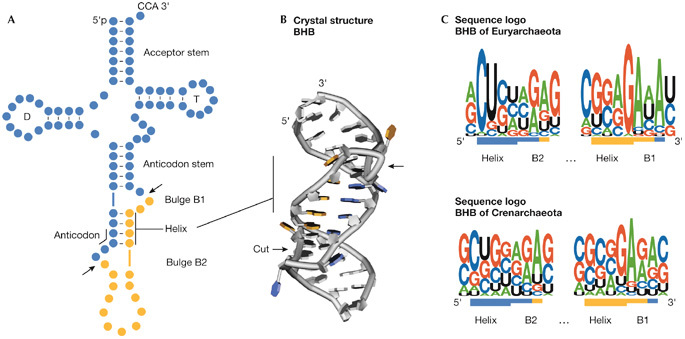
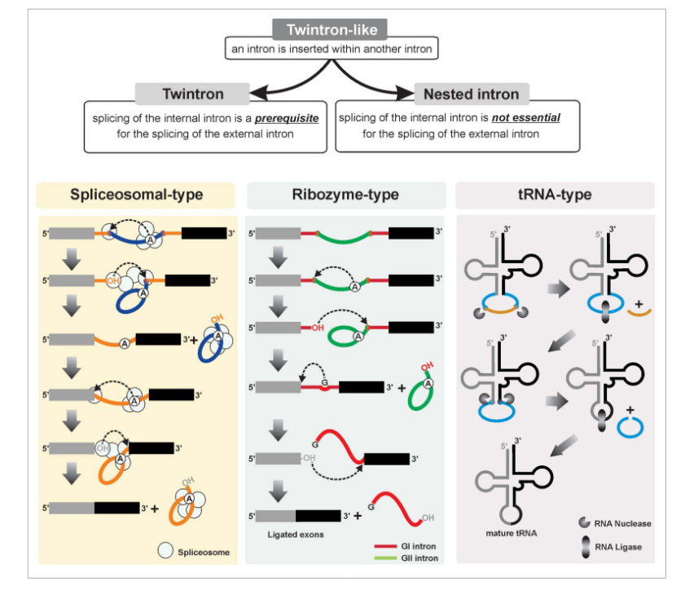
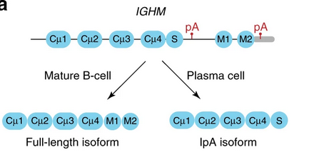
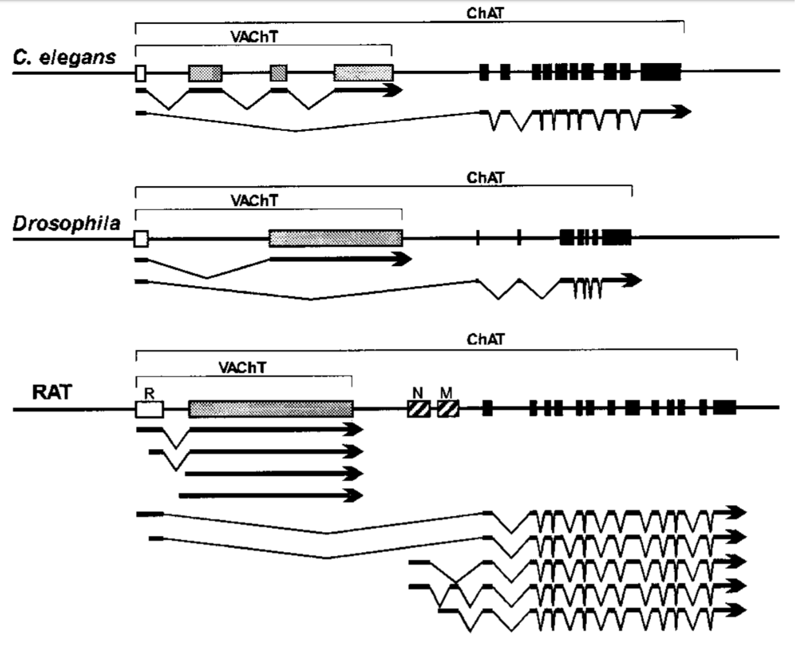
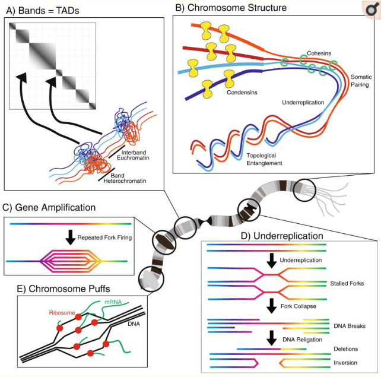

# oddgenes

A list of weird gene annotations or things that break bioinformatics assumptions

See also https://github.com/cmdcolin/oddbiology/ for more weird bio

## Gene structures

### 1bp length exon

Evidence given for a 1bp length exon in Arabidopsis and different splicing
models are discussed

http://www.nature.com/articles/srep18087

Another 1bp exon is discussed here
https://journals.plos.org/plosone/article?id=10.1371/journal.pone.0177959

Microexons in general are an interesting topic and are "involved in important
biological processes in brain development and human cancers" (ref
https://www.cell.com/molecular-therapy-family/nucleic-acids/fulltext/S2162-2531(23)00013-6)
yet are commonly misannotated (e.g. in plants
https://www.nature.com/articles/s41467-022-28449-8)

See also cryptic splice sites, cryptic exons, poison exons

### 0bp length exon

The phenomenon of recursive splicing can remove sequences progressively inside
an intron, so there can exist "0bp exons" that are just the splice-site
sequences pasted together.

"To identify potential zero nucleotide exon-type ratchet points, we parsed the
RNA-Seq alignments to identify novel splice junctions where the reads mapped to
an annotated 5' splice site and an unannotated 3' splice site, and the genomic
sequence at the 3' splice site junction was AG/GT"

https://www.ncbi.nlm.nih.gov/pmc/articles/PMC4529404/

It was found that aberrant recursive splicing could potentially contribute to
disease https://www.biorxiv.org/content/10.1101/2025.08.14.666599v1?med=mas

### Very large introns

Satellite DNA study uncovers megabase scale introns
https://www.biorxiv.org/content/early/2018/12/11/493254

An example in this paper kl-3 spans 4.3 million bp

In human, an example is Dystrophin. "Dystrophin is coded for by the DMD gene –
the largest known human gene, covering 2.4 megabases (0.08% of the human genome)
at locus Xp21. The primary transcript in muscle measures about 2,100 kilobases
and takes 16 hours to transcribe; the mature mRNA measures 14.0 kilobases"
https://en.wikipedia.org/wiki/Dystrophin

Note: these large introns require very large amounts of DNA to be transcribed
into RNA, before just removing most of the transcribed RNA via intron splicing,
which is sort of "wasteful" on a molecular level. The 16-hour transcription time
for dystrophin means that rapidly dividing cells cannot finish transcribing it
before the next cell division interrupts the process
https://pmc.ncbi.nlm.nih.gov/articles/PMC2754300/

### Large number of exons

In human, the TTN (titin) gene has ~364 exons, which is almost double the next
most NEB (nebulin) at ~184 exons

https://www.ncbi.nlm.nih.gov/gene?Db=gene&Cmd=DetailsSearch&Term=7273

### Small introns

"A 2015 study suggests that the shortest known metazoan intron length is 30 base
pairs (bp) belonging to the human MST1L gene
(https://www.ncbi.nlm.nih.gov/pmc/articles/PMC4675715/). The shortest known
introns belong to the heterotrich ciliates, such as Stentor coeruleus, in which
most (> 95%) introns are 15 or 16 bp long
(https://www.ncbi.nlm.nih.gov/pmc/articles/PMC5659724/)"
https://en.wikipedia.org/wiki/Intron#Distribution

A novel splicing factor may be involved in small introns
https://www.news-medical.net/news/20240215/Novel-splicing-mechanism-for-short-introns-discovered.aspx

### Very large proteins

An alga described in 2024 encodes a protein PKZILLA-1 that has a mass of 4.7
megadaltons and contains 140 enzyme domains
https://cen.acs.org/biological-chemistry/PKZILLA-proteins-smash-protein-size/102/web/2024/08

In human the TTN gene encodes the titin protein (in muscle) at almost 4
megadaltons


The DMD gene above, despite being the largest known human gene (2.4 Mb), encodes
a ~427 kDa protein — large, but nowhere near megadalton scale. A shorter isoform
Dp71 (~71 kDa) is expressed in non-muscle tissues.
https://pmc.ncbi.nlm.nih.gov/articles/PMC49288/

### Loop-out exon skipping via inverted Alu repeats

Inverted Alu pairs flanking an exon can fold into an RNA stem-loop hairpin that
physically loops the exon out, causing skipping through RNA secondary structure
alone rather than splicing factors. ~707 human exons are affected, including
TBXT (linked to tail loss in hominoids).

https://academic.oup.com/nar/article/54/6/gkag196/8539533

### Backsplicing and circRNAs

The process of "backsplicing" circularizes RNAs. There can be alternative
backsplicing too


Figure from Dawoud et al. https://doi.org/10.1016/j.ncrna.2022.09.011

See https://academic.oup.com/nar/article/48/4/1779/5715065

### Very large number of isoforms in Dscam

"Dscam has 24 exons; exon 4 has 12 variants, exon 6 has 48 variants, exon 9 has
33 variants, and exon 17 has two variants. The combination of exons 4, 6, and 9
leads to 19,008 possible isoforms with different extracellular domains (due to
differences in Ig2, Ig3 and Ig4). With two different transmembrane domains from
exon 17, the total possible protein products could reach 38,016 isoforms"

Ref https://en.wikipedia.org/wiki/DSCAM
https://www.wikigenes.org/e/gene/e/35652.html

### Translational frameshift/Ribosomal frameshift/Programmed ribosomal frameshift

Ref https://en.wikipedia.org/wiki/Translational_frameshift

https://www.sciencedirect.com/topics/neuroscience/ribosomal-frameshifting

SARS-CoV-2 uses ribosomal frameshifting and this video shows a 3D animation of
the process, showing a 'pseudoknot' in the RNA contributes to it
https://www.youtube.com/watch?v=gLcueW61QMU

Another lecture explaining frameshift in viruses
https://youtu.be/b5BX5A3dGUQ?t=2980

In retroviruses like HIV, the gag and pol genes overlap in different reading
frames. A -1 ribosomal frameshift at a "slippery sequence" between them produces
the Gag-Pol fusion polyprotein at ~5% efficiency, while the other 95% of
ribosomes terminate at the gag stop codon and produce only Gag. This ratio is
critical — altering it is lethal to the virus. The Gag-Pol polyprotein is then
cleaved by the viral protease (which is itself part of the polyprotein) to
produce reverse transcriptase, integrase, and protease.

https://en.wikipedia.org/wiki/Gag-pol https://en.wikipedia.org/wiki/Pol_(HIV)



Figure from Atkins et al. (2016) showing the ribosome encountering a slippery
sequence (X XXY YYZ) and downstream RNA stimulatory element (pseudoknot) that
together promote -1 programmed ribosomal frameshifting
https://pmc.ncbi.nlm.nih.gov/articles/PMC7618472/

### Ribosome hopping

"Ribosome hopping involves ribosomes skipping over large portions of an mRNA
without translating them" Ref https://pubmed.ncbi.nlm.nih.gov/24711422/

The classic example is bacteriophage T4 gene 60, where the ribosome bypasses a
50-nucleotide coding gap — about half of ribosomes successfully make the hop
https://pmc.ncbi.nlm.nih.gov/articles/PMC107096/

### Internal Ribosome Entry Sites (IRES)

An IRES allows ribosomes to initiate translation at an internal position on an
mRNA without scanning from the 5' cap. This enables cap-independent translation
and is used by many viruses to hijack host ribosomes. Some cellular mRNAs also
contain IRES elements, allowing them to be translated under stress conditions
when cap-dependent translation is shut down.

https://en.wikipedia.org/wiki/Internal_ribosome_entry_site

### Stop codon readthrough/translational readthrough

"Stop codon suppression or translational readthrough occurs when in translation
a stop codon is interpreted as a sense codon, that is, when a (standard) amino
acid is 'encoded' by the stop codon. Mutated tRNAs can be the cause of
readthrough, but also certain nucleotide motifs close to the stop codon.
Translational readthrough is very common in viruses and bacteria, and has also
been found as a gene regulatory principle in humans, yeasts, bacteria and
drosophila.[28][29] This kind of endogenous translational readthrough
constitutes a variation of the genetic code, because a stop codon codes for an
amino acid. In the case of human malate dehydrogenase, the stop codon is read
through with a frequency of about 4%.[30] The amino acid inserted at the stop
codon depends on the identity of the stop codon itself: Gln, Tyr, and Lys have
been found for the UAA and UAG codons, while Cys, Trp, and Arg for the UGA codon
have been identified by mass spectrometry.[31] Extent of readthrough in mammals
have widely variable extents, and can broadly diversify the proteome and affect
cancer progression.[32] "

https://en.wikipedia.org/wiki/Stop_codon#Translational_readthrough

### Stop codon re-assignment: selenocysteine

The amino acid Selenocysteine is coded for by an "opal" (UGA) stop codon
(https://en.wikipedia.org/wiki/Selenocysteine)

Is present in all domains of life including humans

As of 2021, 136 human proteins (in 37 families) are known to contain
selenocysteine

A stem-loop structure in the mRNA called a SECIS element
(https://en.wikipedia.org/wiki/SECIS_element) signals the ribosome to read UGA
as selenocysteine instead of stop. The resulting products are called
[selenoproteins](https://en.wikipedia.org/wiki/Selenoprotein).

### Stop codon re-assignment: pyrrolysine

Pyrrolysine also is coded for by the "amber" (UAG) stop codon
(https://en.wikipedia.org/wiki/Pyrrolysine), not present in humans

"It is encoded in mRNA by the UAG codon, which in most organisms is the 'amber'
stop codon. This requires only the presence of the pylT gene, which encodes an
unusual transfer RNA (tRNA) with a CUA anticodon, and the pylS gene, which
encodes a class II aminoacyl-tRNA synthetase that charges the pylT-derived tRNA
with pyrrolysine. "

There are several other stop codon modifications described here
https://www.nature.com/articles/nrg3963

### Stop codons can be created by RNA editing

In mammalian apolipoprotein B, RNA editing introduces a premature stop codon
rather than removing one. The default unedited mRNA encodes the full-length B100
isoform (550 kDa). In the intestine, C-to-U editing at nucleotide 6666 converts
a glutamine codon (CAA) into a stop codon (UAA), producing the truncated B48
isoform (265 kDa). This is one of the best-characterized examples of RNA editing
altering protein output.

https://pubmed.ncbi.nlm.nih.gov/8409768/

### Ciliates with "No stop codons"

"Flexibility in the nuclear genetic code has been demonstrated in ciliates that
reassign standard stop codons to amino acids...Surprisingly, in two of these
species, we find efficient translation of all 64 codons as standard amino acids
and recognition of either one or all three stop codons"

Translation termination is therefore "context dependent" — determined by
surrounding sequence rather than just the 3-letter codon
https://pubmed.ncbi.nlm.nih.gov/27426948/

See also how Ciliates perform programmed DNA elimination (see that section) and
have some of the smallest known introns (see small introns section)

### Readthrough transcription

See also this Ensembl blog on annotating readthrough transcription which joins
multiple genes
http://www.ensembl.info/2019/02/11/annotating-readthrough-transcription-in-ensembl/

RNA-seq often makes extremely compelling cases for two-or-more different genes
to be conjoined by splicing

Some algorithms e.g. mikado
https://academic.oup.com/gigascience/article/7/8/giy093/5057872 try to avoid
this calling it artifactual fusion/chimera that can be due to some tandem
duplication but it does seem to be very prevalent in real data sets

### Non-canonical splice sites

The standard splice site is GT on the 5' end (donor) and AG on the 3' end
(acceptor), processed by the major (U2-type) spliceosome. Non-GT-AG sites exist:
GC-AG is the most common variant (~1% of introns) and is still handled by the
major spliceosome. A separate minor (U12-type) spliceosome handles a distinct
class of introns, originally identified by AT-AC termini but now known to also
include GT-AG introns with different internal sequences.

https://en.wikipedia.org/wiki/Minor_spliceosome

### Cryptic splice sites

Cryptic splice sites are sequences that resemble splice sites but are normally
not used. They can be activated by mutations that disrupt normal splice sites,
or by changes in splicing factor expression. Deep intronic variants are a major
source, accounting for a large fraction of splice-disrupting events in genetic
disease.

Review article https://academic.oup.com/nar/article/39/14/5837/1382796

The snaptron project from Ben Langmead analyzed huge amounts of RNA-seq public
data and found many types of these cryptic splicing http://snaptron.cs.jhu.edu/

SpliceVault and similar tools re-analyze large public RNA-seq datasets to
empirically predict cryptic splice site activation
https://www.nature.com/articles/s41588-022-01293-8

See also cryptic exons, poison exons

### Cryptic exons (pseudoexons)

Cryptic exons are intronic sequences that get erroneously included as exons when
cryptic splice sites flanking them become activated. They usually introduce a
premature termination codon (PTC) that triggers nonsense-mediated decay (NMD),
effectively reducing gene expression. This makes them hard to detect since the
aberrant transcripts are often degraded.

A prominent example involves TDP-43 in ALS/FTD: TDP-43 normally represses
inclusion of nonconserved cryptic exons, and when TDP-43 is depleted from the
nucleus (a hallmark of ALS/FTD pathology), cryptic exons are included in key
neuronal mRNAs like STMN2 and UNC13A
https://www.science.org/doi/10.1126/science.aab0983
https://www.nature.com/articles/s41586-022-04424-7

Review: https://link.springer.com/article/10.1186/s13024-023-00608-5

### Poison exons

Poison exons are conserved alternative exons that contain a premature
termination codon (PTC). When included via alternative splicing, the PTC
triggers NMD, degrading the transcript. Unlike cryptic exons which are
aberrantly activated, poison exons are a deliberate gene regulation mechanism:
cells fine-tune protein levels by adjusting the ratio of productive
(poison-exon-skipped) vs. NMD-targeted (poison-exon-included) transcripts.

Splicing factors like SR proteins and hnRNPs autoregulate their own levels via
poison exon inclusion. Therapeutically, ASOs that block poison exon inclusion
can upregulate expression of disease-relevant genes.

Review https://www.sciencedirect.com/science/article/pii/S0165614725000021

Poison exons in neurodevelopment and disease
https://pmc.ncbi.nlm.nih.gov/articles/PMC8042789/

### Exitrons

Exitrons (exonic introns) are internal regions within protein-coding exons that
can be spliced out like introns. When an exitron is retained it contributes to
the protein sequence; when spliced out it causes an in-frame deletion or
frameshift.

Exitron splicing is dramatically elevated in cancer: one study found 63% of
human coding genes are affected in tumors vs. 17% in normal tissue, and they can
generate tumor-specific neoepitopes
https://www.cell.com/molecular-cell/fulltext/S1097-2765(21)00223-9

Original paper defining exitrons https://genome.cshlp.org/content/25/7/995.full

### Wobble splicing

NAGNAG, GYNGYN, repeats of the splicing signal cause modified splicing behavior

"Another mechanism introducing small variations to protein isoforms is wobble
splicing. Here, a GYN repeat at the donor splice site (5’ splice site; Y stands
for C or T and N stands for A, C, G, or T) or an NAG repeat at the acceptor
splice site (3’ splice site) leads to subtle length variations in the spliced
transcripts and finally to alternative isoforms differing in few amino acids."
ref https://onlinelibrary.wiley.com/doi/full/10.1002/bies.201900066?af=R

### Intron retention

Intron retention (IR) is a phenomenon where intron sequence is preserved, or
doesn't get spliced out, in mature RNA

It can occur in both abnormal and normal biological conditions. Transcript with
IR often undergo nonsense-mediated decay.

https://en.wikipedia.org/wiki/Alternative_splicing

Review: https://pmc.ncbi.nlm.nih.gov/articles/PMC12385487/

### Self-splicing RNA

Normally RNA is spliced by the spliceosome, a ribonucleoprotein complex where
the catalysis is actually performed by its RNA components (snRNAs). There is
also self-splicing RNA where the RNA catalyzes its own splicing without the
spliceosome

Group I introns use a free guanosine as a cofactor to catalyze their own
excision https://en.wikipedia.org/wiki/Group_I_catalytic_intron

Group II introns use a different mechanism (lariat formation, similar to
spliceosomal introns) and are thought to be evolutionary ancestors of the
spliceosome https://en.wikipedia.org/wiki/Group_II_intron

### Bulge helix bulge introns (archael tRNA)

There are some small intron types called "bulge-helix-bulge" in archaea (and
other organisms)



From https://www.embopress.org/doi/full/10.1038/embor.2008.101

The figure above shows that the orange part is excised as an intron for the tRNA

### Twintron

A twintron is an intron-within-an-intron. The internal intron must be spliced
first before the outer one can be recognized and spliced (if the internal one
does not need to be spliced first, it is simply called a nested intron).

See https://en.wikipedia.org/wiki/Twintron



Figure from https://doi.org/10.1080/15476286.2015.1103427 showing twintron
conformations with a) spliceosomal introns b) group I/II self-splicing introns
and c) tRNA/bulge helix bulge type introns

### Introns in viruses

Introns were first discovered in adenoviruses (1977), not eukaryotes — a finding
that won Roberts and Sharp the Nobel Prize

https://en.wikipedia.org/wiki/Intron#Discovery_and_etymology (see also
https://www.proquest.com/docview/303935681/)

### Nuclear mitochondrial (NUMT) insertions

Pieces of the mitochondrial genome can be inserted into nuclear chromosomes in
eukaryotes. The human genome contains over 700 NUMTs. They confound
mitochondrial studies because PCR primers for mtDNA can accidentally amplify
NUMTs, and new insertions continue to occur — some are pathogenic.

https://en.wikipedia.org/wiki/Nuclear_mitochondrial_DNA_segment
https://pmc.ncbi.nlm.nih.gov/articles/PMC3228813/

### Codon tables

Many eukaryotes use the "standard genetic code" for translating codons to amino
acids, but alternative codes are common across the tree of life — especially in
mitochondria, ciliates, and mycoplasma. The NCBI genetic code table lists these
variants

https://www.ncbi.nlm.nih.gov/Taxonomy/Utils/wprintgc.cgi#SG31

One article explains how alternative genetic codes work
https://www.ncbi.nlm.nih.gov/pmc/articles/PMC6207430/

In vertebrate mitochondria, UGA codes for tryptophan instead of stop, and
AGA/AGG code for stop instead of arginine — a direct reversal of the standard
code https://www.ncbi.nlm.nih.gov/Taxonomy/Utils/wprintgc.cgi#SG2

The number of known alternative codes keeps growing — NCBI is currently up to
table 33, and computational screening of 250,000+ genomes (including
metagenome-assembled genomes) has found additional codes not yet officially
adopted https://elifesciences.org/articles/71402

### Untranslated regions

The 5' and 3' UTR (untranslated region) are parts of the mature mRNA that are
not translated into protein — the 5' UTR is before the start codon, the 3' UTR
is after the stop codon. Unlike introns, UTRs are retained in the final mRNA.
They are often targets of miRNA binding which can lead to degradation.

This blog post by Ensembl shows how they annotate UTR and a 19kb 3' UTR in
Grin2b
http://www.ensembl.info/2018/08/17/ensembl-insights-how-are-utrs-annotated/

### Polyadenylation

Polyadenylation is the addition of ~200 adenines to the 3' end of an mRNA. A
polyadenylation signal (typically AAUAAA) in the pre-mRNA is recognized by the
cleavage and polyadenylation complex, which cleaves the RNA and adds the poly-A
tail. The tail is not encoded in the genome. It protects the mRNA from
degradation and aids nuclear export and translation.
https://en.wikipedia.org/wiki/Polyadenylation

A survey of poly-A using Oxford Nanopore found a transcript isoform with a 450bp
poly-A tail (ENST00000581230), with intron retention being a possible correlate
of longer poly-A tails
https://www.biorxiv.org/content/early/2018/11/09/459529.article-info

Polyadenylation normally happens at the end of a transcript, after the last
exon. "Intronic polyadenylation" (IpA) is the confusingly-named phenomenon where
a poly-A signal hiding inside an intron gets used instead. When this happens,
the cell treats that intronic position as "the end" of the transcript —
everything downstream (including remaining exons) is lost. The result is a
shorter mRNA that may encode a truncated protein or no functional protein at
all. The name is confusing because "intronic" suggests something happening
inside an intron that gets spliced away, but here the intron is where
transcription effectively stops. The classic example is immunoglobulin M (IgM):
naive B cells use a downstream poly-A site to produce membrane-bound IgM, but
upon activation, an intronic poly-A site is used instead, producing the shorter
secreted form of IgM. This switch is a key part of the immune response
(https://pmc.ncbi.nlm.nih.gov/articles/PMC9715272/,
https://pubmed.ncbi.nlm.nih.gov/9885564/).



Figure showing "intronic polyadenylation" (IpA) creating a different isoform
from https://www.nature.com/articles/s41467-018-04112-z

In mammalian mitochondria, some mRNAs are polyadenylated immediately after a
genomically encoded U — the poly-A tail supplies the two A's needed to complete
a UAA stop codon. Without polyadenylation, these transcripts would lack a stop
codon entirely (noted in
https://www.ncbi.nlm.nih.gov/Taxonomy/Utils/wprintgc.cgi#SG2).

### Circular chromosomes

Circularized chromosomes should be unsurprising to anyone working with plasmids
and many prokaryotic genomes but for gene annotation formats which use linear
coordinates, representing anything wrapping around the origin is challenging.

While mitochondrial genomes are often assumed to be circular, some eukaryotes
have linear mitochondrial DNA — including certain yeasts (Candida) and some
plants and protists
https://www.sciencedirect.com/science/article/abs/pii/S0168952503003044

Many genomic viewers do not do this well. For GFF format this is done by making
the end go past the end of the genome. Below, the genome is 6407 bp in length,
but the CDS feature extends past this and sets Is_circular=true

```
##gff-version 3.2.1
# organism Enterobacteria phage f1
# Note Bacteriophage f1, complete genome.
J02448  GenBank region  1      6407    .       +       .       ID=J02448;Name=J02448;Is_circular=true;
J02448  GenBank CDS     6006   7238    .       +       0       ID=geneII;Name=II;Note=protein II;
```

GFF3 specification:
https://github.com/the-sequence-ontology/specifications/blob/master/gff3.md

### Dynamic DNA structures in vivo

The replication of the 2 micron plasmid found in Saccharomyces cerevisiae relies
on a programmed DNA rearrangement; in any population of cells two different
states of the 2 micron plasmid can be expected and these will interconvert in
later generations. Reference: https://pubmed.ncbi.nlm.nih.gov/23541845/

### Overlapping genes

It is possible for gene sequences to overlap, on different strands
(sense-antisense) or same strand, possibly in alternate coding frames

https://en.wikipedia.org/wiki/Overlapping_gene

Some articles

- The novel EHEC gene asa overlaps the TEGT transporter gene in antisense and is
  regulated by NaCl and growth phase
  https://www.ncbi.nlm.nih.gov/m/pubmed/30552341/
- Overlapping genes in natural and engineered genomes
  https://www.nature.com/articles/s41576-021-00417-w
- Uncovering de novo gene birth in yeast using deep transcriptomics
  https://www.nature.com/articles/s41467-021-20911-3

Hepatitis B is an extreme example of overlapping genes — its ~3.2 kb genome
packs 4 overlapping reading frames, with every nucleotide belonging to at least
one gene https://pmc.ncbi.nlm.nih.gov/articles/PMC3126273/


Figure from https://commons.wikimedia.org/wiki/File:HBV_Genome.svg

### Antisense transcription

Many genes produce transcripts from both strands of DNA at the same locus. Up to
70% of mammalian genes show evidence of antisense transcription. These natural
antisense transcripts (NATs) can regulate the sense gene through various
mechanisms https://www.nature.com/articles/nrm2738

The Xist/Tsix pair (see X chromosome inactivation section) is a well-known
example — Tsix is an antisense transcript that represses Xist on the active X

### Nested genes (genes within introns)

Entirely distinct genes can reside within the introns of larger genes,
transcribed independently and often from the opposite strand. The NF1 gene (~350
kb, 60 exons) has three genes inside its largest intron (intron 27b, ~60 kb),
all on the opposite strand:

- **OMGP** — oligodendrocyte-myelin glycoprotein, inhibits neurite outgrowth
- **EVI2B** — transmembrane glycoprotein required for granulocytic
  differentiation
- **EVI2A** — putative transmembrane protein involved in hematopoietic
  specification

None carry mutations causative for neurofibromatosis — they are regulated
independently of NF1.

https://pmc.ncbi.nlm.nih.gov/articles/PMC359746/

### Upstream ORFs (uORFs)

Many mRNAs contain small open reading frames in their 5' UTR, upstream of the
main protein-coding ORF. These uORFs are translated by ribosomes before they
reach the main start codon, and can regulate translation of the downstream
protein — often by reducing its translation efficiency, but sometimes by
producing small functional peptides. About 50% of human mRNAs contain uORFs, yet
they are routinely ignored by gene annotation pipelines.

https://en.wikipedia.org/wiki/Upstream_open_reading_frame

## Flybase

### Chimeric genes

Chimeric genes (also called gene fusions) are formed when parts of two or more
previously separate genes combine into a single new gene. This can happen
through several mechanisms: retrotransposition of an mRNA into or near another
gene, tandem duplication followed by fusion, unequal crossing-over between
paralogs, transposon-mediated capture of gene fragments, or even readthrough
transcription followed by retroposition. While many chimeric genes are
nonfunctional, some acquire novel functions and are positively selected.

The gene Jingwei is a chimera (or fusion) of two genes, alcohol dehydrogenase
and yellow emperor in Drosophila. Many chimeras are damaging but this has been
selected for. Remarkably, two other chimeric genes (Adh-Finnegan and Adh-Twain)
also independently derived from Adh via retroposition in different Drosophila
lineages -- parallel chimeric gene evolution from the same parent gene
http://www.pnas.org/content/101/46/16246
https://www.pnas.org/doi/10.1073/pnas.0503528102

Two Cytochrome P450 genes that don't confer any insecticide resistance on their
own but a chimeric P450 does https://pubmed.ncbi.nlm.nih.gov/22949643/

SDIC in Drosophila melanogaster is a chimera of annexin X and cytoplasmic dynein
intermediate chain that converted a cytoplasmic motor protein into a sperm-tail
motor protein by replacing the original functional domain. Present in ~10 tandem
copies on the X chromosome, it boosts sperm competition
https://www.nature.com/articles/25126

Sphinx is a chimeric gene formed by retroposition of an ATP synthase gene that
accumulated nonsense mutations and became a noncoding RNA. Despite losing all
coding potential, it regulates male courtship behavior in Drosophila -- knockout
causes increased male-male courtship
https://www.pnas.org/doi/10.1073/pnas.072066399

TRIMCyp is a fusion of TRIM5 and cyclophilin A created when L1
retrotransposition inserted CypA cDNA into TRIM5. The fusion protein restricts
HIV-1 infection. The same chimeric gene arose independently in both owl monkeys
and pigtailed macaques via separate retrotransposition events -- convergent
evolution at the gene-structure level
https://www.pnas.org/doi/10.1073/pnas.0404640101

PIPSL was created when two adjacent genes (PIP5K1A and PSMD4) were transcribed
as a readthrough mRNA, reverse-transcribed by L1 retrotransposon, and inserted
elsewhere in the genome. Different hominoid species are at different stages of
keeping or losing this gene https://genome.cshlp.org/content/17/8/1129.full

The antifreeze glycoprotein (AFGP) gene in Antarctic notothenioid fish evolved
from a trypsinogen gene. The entire protein core was replaced by de novo
amplification of a 9-nucleotide repeat from a tiny element at the boundary of
trypsinogen's first intron. The resulting protein has zero sequence homology to
its parent gene https://www.pnas.org/doi/10.1073/pnas.94.8.3811

### Transposon-mediated chimeric genes

Transposons can capture fragments of host genes during excision or replication
and carry them to new genomic locations, creating chimeric genes. This
"transduplication" occurs across multiple transposon superfamilies and is a
major source of new genes, especially in plants.

Pack-MULEs in rice carry fragments from >1,000 genes, with ~23% fusing fragments
from multiple loci into chimeric ORFs. Also found in maize and the dicot Lotus
japonicus, suggesting this predates the monocot-dicot split
https://www.nature.com/articles/nature02953

Helitrons (rolling-circle transposons) are the main gene-capturing transposons
in animals, found in maize, bats, fungi, insects, and nematodes
https://www.nature.com/articles/ncomms10716

Gene capture has been observed in real time with Pack-CACTA elements in
Arabidopsis https://academic.oup.com/nar/article/47/3/1311/5198529

A broad survey found gene-capturing "Pack-TYPE" elements across all major DNA
transposon superfamilies (MULEs, CACTAs, Harbingers, hATs)
https://journals.plos.org/plosgenetics/article?id=10.1371/journal.pgen.1010078

## Wormbase

### Adding leader sequence to mRNA

"About 70% of C. elegans mRNAs are trans-spliced to one of two 22 nucleotide
spliced leaders. SL1 is used to trim off the 5' ends of pre-mRNAs and replace
them with the SL1 sequence. This processing event is very closely related to
cis-splicing, or intron removal."

The region that is spliced out is called an outron

http://www.wormbook.org/chapters/www_transsplicingoperons/transsplicingoperons.html


Figure from Lasda & Bhatt (2013)
https://pmc.ncbi.nlm.nih.gov/articles/PMC3795323/

The leader sequence only affects the untranslated region of the mRNA, so it does
not change the resulting protein.

This mechanism has evolved independently 10+ times across very different
organisms. In trypanosomes, 100% of mRNAs get a spliced leader added — it is the
only way to produce individual mRNAs from their polycistronic transcripts
https://royalsocietypublishing.org/doi/10.1098/rsob.190072

In dinoflagellates, all mRNAs also get a spliced leader
https://www.pnas.org/doi/10.1073/pnas.0700258104

The tunicate Oikopleura dioica is the only chordate known to use it
https://pmc.ncbi.nlm.nih.gov/articles/PMC507004/

Copepod crustaceans use it too (discovered 2015), even though insects and most
other arthropods do not https://www.nature.com/articles/srep17411

Also found in flatworms, rotifers, ctenophores, glass sponges, chaetognaths,
euglenids, and cryptomonads
https://academic.oup.com/mbe/article/27/3/684/1002183

The leader sequences are very similar within a phylum but totally different
between phyla, suggesting many independent origins
https://www.frontiersin.org/journals/genetics/articles/10.3389/fgene.2013.00199/full

The basal nematode Trichinella spiralis is an outlier — instead of the standard
SL1, it has at least 15 diverse non-canonical spliced leaders
https://pmc.ncbi.nlm.nih.gov/articles/PMC2271357/

### Polycistronic transcripts/operons

Although prevalent in bacteria, operons are not common in eukaryotes. However,
they are common in C. elegans specifically. "A characteristic feature of the
worm genome is the existence of genes organized into operons. These
polycistronic gene clusters contain two or more closely spaced genes, which are
oriented in a head-to-tail direction. They are transcribed as a single
polycistronic mRNA and separated into individual mRNAs by the process of
trans-splicing"

http://www.wormbook.org/chapters/www_overviewgenestructure.2/genestructure.html

Another paper says "Once considered rare in eukaryotes, polycistronic mRNA
expression has been identified in kinetoplastids and, more recently, green
algae, red algae, and certain fungi. This study provides comprehensive evidence
supporting the existence of polycistronic mRNA expression in the apicomplexan
parasite Cryptosporidium parvum"

https://www.biorxiv.org/content/10.1101/2025.01.17.633476v1.full.pdf

### Trans-splicing of exons on different strands

A pre-mRNA from both strands of DNA eri6 and eri7 are combined to create eri-6/7

https://pmc.ncbi.nlm.nih.gov/articles/PMC2756026/

### Exon shared across different genes

An example from drosophila, C. elegans, and rat shows a gene with a 5' exon
being shared between two genes



https://www.fasebj.org/doi/full/10.1096/fj.00-0313rev

An example here shows 5'UTR exons shared across different olfactory receptor
genes ("Some OR genes share 5'UTR exons")

https://www.biorxiv.org/content/biorxiv/early/2019/09/19/774612.full.pdf

## Evolution

### Possible adaptive bacteria->eukaryote HGT

A possible horizontal gene transfer from bacteria to eukaryotes is found in an
insect that feeds on coffee beans. Changes that the gene had to undergo are
covered (added poly-A tail, Shine-Dalgarno sequence deleted)

https://www.ncbi.nlm.nih.gov/pmc/articles/PMC3306691/

also https://www.cell.com/cell/fulltext/S0092-8674(19)30097-2

## Codon usage

### Alternative start codons

"The most common start codons for known Escherichia coli genes are AUG (83% of
genes), GUG (14%) and UUG (3%)"

"Here, we systematically quantified translation initiation of green fluorescent
protein (GFP) from all 64 codons and nanoluciferase from 12 codons on plasmids
designed to interrogate a range of translation initiation conditions."

https://www.sciencedaily.com/releases/2017/02/170221080506.htm

Testing in eukaryotes has also revealed alternative starts being viable
https://en.wikipedia.org/wiki/Start_codon#Eukaryotes

## Molecular

### 4-base/quaternary/quadruplet codons

3-base codon system is assumed by many, but engineered tRNAs can decode 4-base
codons with potential applications for using amino acids outside the 20
canonical ones

review https://elifesciences.org/articles/78869

evolving improved 4-base efficiency
https://www.nature.com/articles/s41467-021-25948-y

### Complex DNA structures

The standard DNA double stranded helix is called B-DNA

"There are also triple-stranded DNA forms and quadruplex forms such as the
G-quadruplex and the i-motif. "
https://en.wikipedia.org/wiki/Nucleic_acid_double_helix

### Maxicircle architecture

Seen in trypanosomes. The kinetoplast DNA network contains two types of circles:
maxicircles (~20-40 kb) encode mitochondrial genes, but many of their
transcripts are "cryptogenes" — essentially unreadable without extensive RNA
editing. The guide RNAs that direct this editing are encoded on thousands of
minicircles (~1 kb each) in the same network. See also the RNA editing section.


Figure from
https://www.sciencedirect.com/topics/agricultural-and-biological-sciences/kinetoplast-dna

https://pmc.ncbi.nlm.nih.gov/articles/PMC4835692/

### Fragmented mitochondrial genomes

Mitochondrial genomes are usually a single circular (or linear) molecule, but in
dinoflagellates they are broken into multiple small linear chromosomes (~6-10 kb
each). Only 3 protein-coding genes remain (cox1, cox3, cob), and even those are
split into fragments that must be separately transcribed and pieced together
https://academic.oup.com/mbe/article/24/7/1528/987488

### Triplex DNA

https://en.wikipedia.org/wiki/Triple-stranded_DNA

### Polytene chromosome

Some organisms, famously insects in their salivary glands, create many copies of
genes through multiple phases of incomplete DNA replication
https://en.wikipedia.org/wiki/Polytene_chromosome



Figure source https://www.ncbi.nlm.nih.gov/pmc/articles/PMC5768140/

"Polytene chromosomes are produced by endoreplication, in which chromosomal DNA
undergoes repeated replication without cell division. Ten rounds of
endoreplication produces 2^10 = 1,024 DNA strands, which when arranged alongside
of each other produce distinctive banding patterns. Endoreplication occurs in
cells of the larval salivary glands of many species of Diptera, and increases
production of mRNA for Glue Protein that the larvae use to anchor themselves to
the walls of (for example) culture vials." from
https://www.mun.ca/biology/scarr/Polytene_Chromosomes.html

### Endoreplication

The above section about polytene chromosomes mentions endoreplication but this
can also affect many other contexts and was mentioned as an issue in genome
assembly of some plants. A talk given about vanilla bean found a lot of
endoreplication during their genome assembly which leads to very uneven
coverage. They tried to select tissue samples that had the least amount of
endoreplication.
https://plan.core-apps.com/pag_2023/abstract/e26dbeb1-df8f-4c57-a062-dcaf881b79f4

### Endo-(poly)ploidy

Different cells may have different numbers of copies of chromosomes and it also
occurs in some human cell types: "polyploid cells can exist in otherwise diploid
organisms (endopolyploidy). In humans, polyploid cells are found in critical
tissues, such as liver and placenta. A general term often used to describe the
generation of polyploid cells is endoreplication, which refers to multiple
genome duplications without intervening division/cytokinesis"
https://www.ncbi.nlm.nih.gov/pmc/articles/PMC4442802/

### Programmed DNA elimination

"While we commonly assume the genome to be largely identical across different
cells of a multicellular organism, a number of species undergo a developmental
regulated elimination process by which the genome in somatic cells is reduced,
while the germline genome remains intact. This process, called Programmed DNA
Elimination (PDE), affects a number of species including copepod crustaceans,
lamprey fish, single-celled ciliates and nematode worms (though not C.
elegans!)."

From ISMB2023 video "Deciphering developmentally programmed DNA elimination in
Mesorhabditis nematodes" https://www.youtube.com/watch?v=2x6ElKeISRY

Ciliates are the most extreme case — spirotrich ciliates like Oxytricha can
eliminate over 95% of their germline genome when building the somatic
macronucleus, including virtually all transposons. Even in Tetrahymena and
Paramecium, 20-30% of the germline genome is discarded
https://pmc.ncbi.nlm.nih.gov/articles/PMC3839606/


Figure from Noto & Mochizuki (2017)
https://pmc.ncbi.nlm.nih.gov/articles/PMC5666084/

See also the term "internal eliminated sequences" (IES)

### Self-editing genomes

"How and when organisms edit their own genomes"
https://www.nature.com/articles/s41588-025-02230-1

Programmed DNA elimination, VDJ recombination, CRISPR, germline restricted
chromosomes, and more are examples of self-editing (quote from article: "Notable
examples include the somatic diversification of immunoglobulin genes, which is
the foundation of the vertebrate immune system, and natural CRISPR spacer arrays
in bacteria, which recognize and cleave foreign DNA")

## Germline-restricted chromosomes

"Germline-restricted chromosomes (GRCs) are accessory chromosomes that occur
only in germ cells. They are eliminated from somatic cells through programmed
DNA elimination during embryo development. GRCs have been observed in several
unrelated animal taxa and show peculiar modes of non-Mendelian inheritance and
within-individual elimination. "

https://pmc.ncbi.nlm.nih.gov/articles/PMC9508068/

## Non-random segregation of chromosomes

Some chromosomes "cheat" — they are preferentially passed to certain daughter
cells instead of the expected 50/50 split, letting them spread faster than
Mendelian genetics predicts. Related to meiotic drive and gene drives.

https://en.wikipedia.org/wiki/Non-random_segregation_of_chromosomes

See https://github.com/cmdcolin/oddbiology/ for more examples and details

### Range of ploidy

Wikipedia lists this table with examples of organisms with different ploidy
https://en.wikipedia.org/wiki/Polyploidy#Types

- haploid (one set; 1x), for example male European fire ants
- diploid (two sets; 2x), for example humans
- triploid (three sets; 3x), for example sterile saffron crocus, or seedless
  watermelons, also common in the phylum Tardigrada[7]
- tetraploid (four sets; 4x), for example, Plains viscacha rat, Salmonidae
  fish,[8] the cotton Gossypium hirsutum[9]
- pentaploid (five sets; 5x), for example Kenai Birch (Betula kenaica)
- hexaploid (six sets; 6x), for example some species of wheat,[10] kiwifruit[11]
- heptaploid or septaploid (seven sets; 7x)
- octaploid or octoploid, (eight sets; 8x), for example Acipenser (genus of
  sturgeon fish), dahlias
- decaploid (ten sets; 10x), for example certain strawberries
- dodecaploid or duodecaploid (twelve sets; 12x), for example the plants Celosia
  argentea and Spartina anglica [12] or the amphibian Xenopus ruwenzoriensis.
- tetratetracontaploid (forty-four sets; 44x), for example black mulberry[13]

### DNA modifications

There are many chemical modifications that can happen to DNA, leading to an
"extended alphabet" with functional changes.

A common DNA modification is called methylation. The most common is a 5mC
modification, a methylation of the letter C, and is mostly found in a CpG (a C
followed by a G in the genome)

Many other modifications exist, see https://dnamod.hoffmanlab.org/

## RNA world

### RNA modifications

https://www.hindawi.com/journals/jna/2011/408053/tab1/

updated link on hindawi should point here http://mods.rna.albany.edu/mods/ (this
link now dead too, see maybe http://genesilico.pl/modomics/modifications)

### RNA editing

RNA editing is a post-transcriptional modification to the mRNA, which can change
what we would see when the RNA is sequenced. A-to-I editing is common in some
species, which would make the RNA, when sequenced, appear to have a G instead of
an A. If the genome was sequenced, it would not show a SNP but the RNA-seq would
appear to have A->G.

RNA editing can be conditional; mammalian apolipoprotein B is synthesized as a
full-length B100 form (550 kDa) by default, but C-to-U editing in the intestine
introduces a premature stop codon to produce the shorter B48 form (265 kDa)

Other editing also occurs https://en.wikipedia.org/wiki/RNA_editing

In trypanosome mitochondria, extensive U-insertion/deletion editing can more
than double the length of some transcripts — the genomic sequence is essentially
a compressed template that is "decoded" by editing. The instructions for editing
come from guide RNAs encoded on minicircles in the kinetoplast DNA (see
maxicircle architecture section).
https://en.wikipedia.org/wiki/RNA_editing#Kinetoplastids

### Post-Transcriptional Exon Shuffling (PTES)

While the exon structure of most mRNAs follows the linear sequence of the
transcribed DNA, there are a few cases where mature mRNAs contain exons in a
non-linear order.

Al-Balool and Weber _et al_ (2011) validated several cases of PTES in human
genes that are evolutionarily conserved, including _MAN1A2_, _PHC3_, _TLE4_, and
_CDK13_: https://genome.cshlp.org/content/21/11/1788.short

### Maternal RNAs being passed down

Maternal RNAs can show activity in the zygote (e.g.
https://en.wikipedia.org/wiki/Maternal_to_zygotic_transition), which can lead to
complex transgenerational effects

### Lowly expressed RNA has large effects

A lncRNA VELUCT almost flies under the radar in a lung cancer screen due to
being very lowly expressed, such that it is "below the detection limit in total
RNA from NCI-H460 cells by RT-qPCR as well as RNA-Seq", however this study
confirms it as a factor in experiments (2025 note: this article has basically no
citations, unclear whether it actually is impactful)

https://www.ncbi.nlm.nih.gov/pubmed/28160600?dopt=Abstract

Note that X inactivation relies on relatively lowly expressed RNA also
https://twitter.com/mitchguttman/status/1454256452990734336

### X chromosome inactivation

X inactivation is a form of dosage compensation — equalizing X-linked gene
expression between XX and XY individuals. In mammals, one X in each female cell
is silenced early in development by Xist, a long non-coding RNA that spreads
along the chromosome in cis, recruiting silencing complexes. An antisense
transcript Tsix represses Xist on the active X.

Not all genes on the inactive X are silenced — about 15-25% of human X-linked
genes "escape" inactivation and are expressed from both copies. This is relevant
to bioinformatics because these escapee genes show biallelic expression in
females where you might expect monoallelic.

https://en.wikipedia.org/wiki/X-inactivation

https://www.youtube.com/watch?v=y3ST0whbA4k (great series from iBiology on X
chromosome inactivation)

See https://github.com/cmdcolin/oddbiology/ for calico cats, mosaicism, and how
different organisms solve dosage compensation in completely different ways

### Types of RNA

There are many types of RNA some more weird and exotic than others, a large list
https://en.wikipedia.org/wiki/List_of_RNAs

Some are named based on where they are expressed or active

Others are uniquely shaped. There are also circular RNA for example
https://en.wikipedia.org/wiki/Circular_RNA

Small and long non coding RNAs often fold into important structural shapes

## Proteins

### Removal of start amino acid in proteins

This is probably obvious to many people who work on proteins but while the
genome has almost all genes starting with a start codon which produces
methionine, this is often post translationally removed
https://en.m.wikipedia.org/wiki/Methionyl_aminopeptidase

### Inteins

An intein is a segment of a protein that catalyzes its own excision after
translation, joining the flanking segments (exteins) together. Like introns for
RNA, but at the protein level. https://en.wikipedia.org/wiki/Intein

See section here
https://github.com/The-Sequence-Ontology/Specifications/blob/master/gff3.md#pathological-cases

### Polyprotein

Viral sequences can create a polyprotein which is fully transcribed and
translated before being cleaved by a protease. In some viruses (such as
coronaviruses) their translation involves ribosomal frameshifting.

Dengue, HIV, etc. use this

https://www.ncbi.nlm.nih.gov/pmc/articles/PMC6040172/
https://www.sciencedirect.com/science/article/abs/pii/S0959440X15000597

Some viruses use an alternative mechanism: 2A peptides cause the ribosome to
skip forming a peptide bond during translation, effectively splitting the
polyprotein without a protease. These are now widely used as a biotechnology
tool for expressing multiple proteins from one mRNA
https://pmc.ncbi.nlm.nih.gov/articles/PMC5438344/

### Interesting PDB entries

From another repo
https://github.com/molstar/molstar/blob/master/docs/docs/misc/interesting-pdb-entries.md

## Transposons

Transposable elements make up ~45% of the human genome
(https://www.nature.com/articles/nature01262) and up to 85% of some plant
genomes like maize (https://www.science.org/doi/10.1126/science.1178534).

### Cross-species BovB transposon transfers

Or "How a quarter of the cow genome came from snakes"
http://phenomena.nationalgeographic.com/2013/01/01/how-a-quarter-of-the-cow-genome-came-from-snakes/

Source http://www.pnas.org/content/110/3/1012.full

### LINE1 important for embryonic development

LINE1 elements are normally kept silenced by the host, but evidence shows that
LINE1 transcription is important for embryonic development.

https://www.ucsf.edu/news/2018/06/410781/not-junk-jumping-gene-critical-early-embryo

### Transposons as the origin of the adaptive immune system

The RAG1/RAG2 recombinase that performs V(D)J recombination (see Immunity)
derives from an ancient Transib transposon. The vertebrate adaptive immune
system is essentially a domesticated transposon.

https://www.nature.com/articles/nature03564

### Transposon-derived genes

CENPB, which binds centromeric DNA, derives from a pogo-like transposase
https://www.nature.com/articles/384567a0

See also https://github.com/cmdcolin/oddbiology/ for syncytins and Arc
(retroviral elements co-opted for placental development and neuronal
communication)

### Helitrons (rolling-circle transposons)

Replicate via rolling-circle mechanism, can capture and shuffle host gene
fragments to create chimeric genes. ~2% of the maize genome.

https://en.wikipedia.org/wiki/Helitron_(biology)

### Maverick/Polinton transposons

Giant DNA transposons (~15-20 kb) encoding their own DNA polymerase. May be
evolutionary ancestors of some DNA viruses.

https://en.wikipedia.org/wiki/Polinton

## Immunity

### VDJ Recombination

VDJ recombination is a process of somatic DNA recombination in immune cells.

In bio 101 you learn: a gene is made of exons separated by introns, the cell
transcribes the gene into RNA, introns are spliced out, and the exons are joined
together in the mRNA. The DNA itself is never changed — every cell in your body
has the same genome.

VDJ recombination breaks this rule. The genome contains arrays of V (variable),
D (diversity), and J (joining) gene segments — many copies of each type,
arranged in tandem. Instead of just transcribing and splicing RNA, immune cells
physically cut the chromosomal DNA, join one V to one D to one J segment, and
delete the intervening DNA. Which segments end up joined is essentially random.
This is a permanent, irreversible change to the genome of that cell. The result
is a brand-new exon that didn't exist in the germline genome. Only then does
normal RNA splicing happen to join this newly assembled VDJ exon to the constant
region exons downstream — as Janeway's Immunobiology puts it: "To make a
complete immunoglobulin light-chain messenger RNA, the V-region exon is joined
to the C-region sequence by RNA splicing after transcription."


Figure from https://commons.wikimedia.org/wiki/File:VDJ_recombination.png

This is why V, D, and J are called "gene segments" rather than "exons" — they
are raw parts that must be assembled at the DNA level first, before the normal
exon-intron splicing machinery can do its job.

The recombination is guided by flanking "recombination signal sequences" and is
deliberately imprecise — terminal transferase adds random nucleotides at the
junctions, further diversifying the sequences. This is how a limited number of
gene segments (~100 V + ~30 D + ~6 J in humans) can generate billions of
different antibodies.

This is called "somatic" recombination because it happens in somatic cells
(developing B and T cells), not in the germline — the rearrangements are not
passed to offspring. In most biology, recombination only occurs during meiosis
in germ cells, where homologous chromosomes exchange segments. VDJ recombination
is fundamentally different: it uses a dedicated enzyme complex (RAG1/RAG2) that
evolved from an ancient transposon (see Transib above). RAG cuts at specific
recombination signal sequences, and the broken ends are repaired by the cell's
general-purpose NHEJ (non-homologous end joining) DNA repair pathway. So VDJ
recombination is possible in somatic tissue because the cell already has the DNA
repair machinery — RAG just co-opts it by making targeted double-strand breaks
at the right places. Most somatic cells do not express RAG, which is why only
lymphocytes undergo this rearrangement.

https://en.wikipedia.org/wiki/V(D)J_recombination
https://www.ncbi.nlm.nih.gov/books/NBK27140/

### MHC region

The MHC region is a very polymorphic region of the genome on chr6. I'm not
personally familiar with all the intricacies of MHC beyond that it is a unique
contributor of some additional hg38 alternative loci/contigs due to its high
diversity

- https://en.wikipedia.org/wiki/Major_histocompatibility_complex

- https://en.wikipedia.org/wiki/Human_leukocyte_antigen

## Repeats

### 235kb of just just TAG

In the Maize genome, Mo17, sequenced "T2T", they mention this very large simple
repeat in the abstract...cause it's that silly

https://www.nature.com/articles/s41588-023-01419-6

## Structural variations

### Tandem duplication

A tandem duplication can be seen as a piece of DNA that copied side by side in
the genome. But why would this occur?

Some biological factors can include

- replication slippage
- retrotransposition
- unequal crossing over (UCO).
- imperfect repair of double-strand breaks by nonhomologous end joining (NHEJ)
  (specifically generates 1-100bp range indels according to article)

Ref https://academic.oup.com/mbe/article/24/5/1190/1038942

### Segmental duplications

Segmental duplications (SDs) are blocks of DNA (1 kb to hundreds of kb) present
in two or more copies with >90% sequence identity. About 5-7% of the human
genome is segmentally duplicated. They are a major headache for genome assembly
— high identity causes collapsed or missing regions. T2T-CHM13 increased known
SD content from 167 Mbp (5.4%) to 218 Mbp (7.0%), accounting for nearly
one-third of newly assembled sequence.

https://www.science.org/doi/10.1126/science.abj6965

SDs serve as substrates for generating copy number variants (CNVs) via
non-allelic homologous recombination (NAHR): meiotic recombination between
paralogous copies instead of true alleles produces deletions, duplications, or
inversions. Other CNV mechanisms include NHEJ, FoSTeS/MMBIR (replication-based
template switching), and BFB cycles.

https://www.nature.com/articles/nrg2593

Medically important examples of NAHR between flanking SDs:

- **22q11.2 deletion** (DiGeorge) — most common human microdeletion (~1:3,000)
  https://pmc.ncbi.nlm.nih.gov/articles/PMC1310636/
- **CMT1A / HNPP at 17p12** — 1.5 Mb duplication (CMT1A) or reciprocal deletion
  (HNPP) affecting PMP22 dosage https://omim.org/entry/118220
- **SMA** — SMN1 loss in one of the most complex SD regions; most assemblies
  still don't correctly resolve SMN1/SMN2
  https://pubmed.ncbi.nlm.nih.gov/15470363/
- **Prader-Willi / Angelman at 15q11-q13** — same deletion, different syndrome
  depending on parent-of-origin (imprinting)
  https://pmc.ncbi.nlm.nih.gov/articles/PMC4449422/

### Complex structural variations in cancer

Cancer genomes harbor catastrophic rearrangements beyond simple deletions and
duplications:

- **Chromothripsis** — chromosome shattering and random reassembly in a single
  event, in >50% of some cancer types
  https://www.nature.com/articles/s41588-019-0576-7
- **Chromoplexy** — chains of balanced translocations across up to eight
  chromosomes, prevalent in prostate cancer (>60%)
  https://pmc.ncbi.nlm.nih.gov/articles/PMC3673705/
- **Chromoanasynthesis** — replication-based template switching producing
  localized duplications/triplications https://www.nature.com/articles/nm.2988
- **Extrachromosomal DNA (ecDNA)** — circular DNA (~1-5 Mb) replicating
  autonomously, driving oncogene amplification (EGFR, MYC) in ~17% of cancers.
  Lacks centromeres so segregates unequally
  https://www.nature.com/articles/s41576-022-00521-5
- **Breakage-fusion-bridge (BFB) cycles** — telomere loss causes sister
  chromatid fusion, anaphase bridge, and breakage, repeating to produce
  staircase amplification. Can trigger chromothripsis and ecDNA
  https://www.nature.com/articles/s41467-023-41259-w
- **Kataegis** — localized hypermutation clusters caused by APOBEC deaminases on
  single-stranded DNA at break sites https://elifesciences.org/articles/00534
- **Tyfonas, Pyrgo, Rigma** — novel complex SV classes: tyfonas (fold-back
  inversions, acral melanoma), pyrgo (tandem duplications, breast/ovarian),
  rigma (deletions at fragile sites, GI cancers)
  https://www.cell.com/cell/fulltext/S0092-8674(20)30997-1

## Pseudogenes

### A pseudogene that can protect against cancer in Elephants

The LIF gene has many copies in Elephant but many are non-functional. One copy
can be "turned back on" and play a role in cancer protection. They call this a
"zombie gene"

https://www.cell.com/cell-reports/fulltext/S2211-1247(18)31145-8

https://www.sciencealert.com/lif6-pseudogene-elephant-tumour-suppression-solution-petos-paradox

## Regulation

### Intron mediated enhancement (IME)

It has been shown that some intron sequences can enhance expression similar to
how promoter sequences work
https://en.wikipedia.org/wiki/Intron-mediated_enhancement

The first intron of the UBQ10 gene in Arabidopsis exhibits IME, and "the
sequences responsible for increasing mRNA accumulation are redundant and
dispersed throughout the UBQ10 intron"
http://www.plantcell.org/content/early/2017/04/03/tpc.17.00020.full.pdf+html

The classic peppered moth phenotype is an intron TE insertion
https://www.nature.com/articles/nature17951 (may not be strictly IME, I'm
personally not sure)

### Genomic imprinting

Imprinted genes are expressed from only one parental allele. In humans, ~100-200
genes are imprinted. Classic examples: IGF2 (paternal only) and H19 (maternal
only) share a regulatory region on chr11. The same chromosomal deletion at
15q11-q13 causes Prader-Willi syndrome if inherited from dad, or Angelman
syndrome if from mom.

https://en.wikipedia.org/wiki/Genomic_imprinting

### Bidirectional promoters

Wikipedia
https://en.wikipedia.org/wiki/Promoter_(genetics)#Bidirectional_(mammalian)

"Bidirectional promoters are a common feature of mammalian genomes. About 11% of
human genes are bidirectionally paired."

"The two genes are often functionally related, and modification of their shared
promoter region allows them to be co-regulated and thus co-expressed"

See also 'divergently paired genes'
https://academic.oup.com/gpb/article/23/4/qzaf058/8174973?login=false&utm_source=etoc&utm_campaign=gpb&utm_medium=email&nbd_source=campaigner&nbd=45398946253

## Chromosomal abnormalities

### Uniparental disomy (UPD)

A child can inherit both copies of a particular chromosome from one parent,
instead of the "usual" one copy from mom, one from dad

"UPD arises usually from the failure of the two members of a chromosome pair to
separate properly into two daughter cells during meiosis in the parent’s
germline (nondisjunction). The resulting abnormal gametes contain either two
copies of a chromosome (disomic) or no copy of that chromosome (nullisomic),
instead of the normal single copy of each chromosome (haploid). This leads to a
conception with either three copies of one chromosome (trisomy) or a single copy
of a chromosome (monosomy). If a second event occurs by either the loss of one
of the extra chromosomes in a trisomy or the duplication of the single
chromosome in a monosomy, the karyotypically normal cell may have a growth
advantage as compared to the aneuploid cells. UPD results primarily from one of
these “rescue” events"

https://www.ncbi.nlm.nih.gov/pmc/articles/PMC3111049/

### Mosaic loss of Y chromosome

Older men can have a mosaic loss of the Y chromosome
https://en.wikipedia.org/wiki/Mosaic_loss_of_chromosome_Y

https://www.karger.com/Article/FullText/508564 (found from
https://www.biostars.org/p/9482437/)

may be associated with cardiac issues
https://www.science.org/doi/10.1126/science.abn3100

### Mosaic loss of X chromosome

Similar to the above but for X
https://www.cancer.gov/news-events/press-releases/2024/genetic-factors-predict-x-chromosome-loss

### Ring chromosome

In organisms with normally linear chromosomes, circular or "ring" chromosomes
can form from aberrant processes https://en.wikipedia.org/wiki/Ring_chromosome


There are also smaller fragments that can be circularized called "supernumerary
small ring chromosomes" (sSRC) or their normal linear part, "supernumary small
marker chromosomes" (sSMC)
https://en.wikipedia.org/wiki/Small_supernumerary_marker_chromosome

## File formats

### Non-ACGT letters in fasta files

The latest human genome, for example, downloaded from NCBI, contains a number of
Non-ACGT letters in the form of IUPAC codes
https://www.bioinformatics.org/sms/iupac.html These represent ambiguous bases.

Here is the incidence of non-ACGTN IUPAC letters in the entire human genome
GRCh38.p14 from
https://ftp.ncbi.nlm.nih.gov/refseq/H_sapiens/annotation/GRCh38_latest/refseq_identifiers/GRCh38_latest_genomic.fna.gz
(same for the "analysis set" files in
https://ftp.ncbi.nlm.nih.gov/genomes/all/GCA/000/001/405/GCA_000001405.15_GRCh38/seqs_for_alignment_pipelines.ucsc_ids/)

```
{
  'B' => 2,
  'K' => 8,
  'Y' => 36,
  'M' => 8,
  'R' => 29,
  'W' => 15,
  'S' => 5
};
```

Did you expect that in your bioinformatics software? Note that the mouse genome
(GRCm38.p5) as far as I could tell does not contain any non-ACGT IUPAC letters

See [count_fasta_letters.pl](count_fasta_letters.pl) for a script to count this.
The UCSC hg38.fa.gz does not have any non-ACGTN letters.

### rs SNP identifiers occurring in multiple places

Due to how dbSNP is created (based on alignments), an rs ID can occur in
multiple places on the genome https://www.biostars.org/p/2323/

### Weird characters in FASTA sequence names

In response to hg38 including a colon in sequence names, which conflicts with
commonly used representation of a range as chr1:1-100 for example (note:
SAMv1.pdf contains a regex to help resolve this), people analyzed meta-character
frequencies in sequence names https://github.com/samtools/hts-specs/issues/291

```
ENA
#   16927
*   1
,   231
-   122563947
.   521540419
/   236951
\   0
:   30181
;   72892
=   186611
@   3713
|   949

Broad(?)
     12 #
    527 *
    357 ,
1451132 -
1492749 .
  86114 /
 233731 :
   2034 =
     17 @
1735713 |

Reference sequences
 # 203
 % 203
 * 525
 + 1
 , 496
 - 154226
 . 1826561
 : 1577
 = 26
 _ 4961932
 | 1098333
```

Note that commas in FASTA names is being suggested as an illegal character
because of the supplementary alignment tag in SAM/BAM using comma separated
values

## Humongous chromosomes V1

Genomes such as wheat have large chromosomes averaging 806Mbp but the BAI/TBI
file formats are limited to 2^29-1 ~ 536Mbp in size (this is due to the binning
strategy, the max bin size is listed as 2^29). The CSI index format was created
to help index BAM and tabix files with large chromosomes.

Bonus: I made a web tool to help visualize BAI files to show how the binning
index works https://cmdcolin.github.io/bam_index_visualizer/

## Humongous chromosomes V2

The axolotl genome has individual chromosomes that are of size 3.14 Gbp
https://genome.cshlp.org/content/29/2/317.long (2019) which is almost as big as
the entire human genome

The BAM and CRAM formats can only store 2^31-1 (~2.14Gbp) length chromosomes
however so bgzip/tabix SAM is used (discussion
https://github.com/samtools/hts-specs/issues/655)

## Largest genomes

Just some honorable mentions for largest genome

- Polychaos dubium/Amoeba dubium/Chaos chaos - ~600-1300Gbp (unsequenced, 1968
  back of envelope measurement, needs confirmation)
  https://en.wikipedia.org/wiki/Polychaos_dubium (another ref
  https://bionumbers.hms.harvard.edu/bionumber.aspx?&id=117342)
- Dinoflagellates - up to 250Gbp (unsequenced, 1987 book referenced in this
  paper, needs confirmation, has weird chromosome "rod-like" structures)
  https://www.nature.com/articles/s41588-021-00841-y
- Tmesipteris oblanceolata (fork fern) - ~160Gb (unsequenced)
  https://www.nature.com/articles/d41586-024-01567-7
- Paris japonica (canopy plant) - ~149Gbp (unsequenced)
  https://en.wikipedia.org/wiki/Paris_japonica
- Tmesipteris_obliqua (fern) - ~147Gbp (unsequenced) -
  https://en.wikipedia.org/wiki/Tmesipteris_obliqua
- South American lungfishes (Lepidosiren paradoxa) - ~91Gbp (sequenced)
  https://www.nature.com/articles/s41586-024-07830-1
- European mistletoe - ~90Gbp (sequenced)
  https://www.darwintreeoflife.org/news_item/2022-the-year-we-built-the-biggest-genome-in-britain-and-ireland/
- Antarctic krill - ~48Gbp (sequenced)
  https://www.cell.com/cell/pdf/S0092-8674(23)00107-1.pdf
- Neoceratodus forsteri (Australian lungfish) - ~43Gbp (sequenced)
  https://www.smithsonianmag.com/smart-news/australian-lungfish-has-biggest-genome-ever-sequenced-180976837/
  https://www.ncbi.nlm.nih.gov/genome/?term=Neoceratodus+forsteri
- Ambystoma mexicanum (axolotl) - ~32Gbp (sequenced)
  https://en.wikipedia.org/wiki/Axolotl
  https://www.ncbi.nlm.nih.gov/genome/?term=axolotl
- Allium ursinum (wild garlic) - ~30gb https://en.wikipedia.org/wiki/Onion_Test
- Coastal redwood - ~26Gbp (sequenced)
  https://www.ucdavis.edu/climate/news/coast-redwood-and-sequoia-genome-sequences-completed
  https://www.ncbi.nlm.nih.gov/genome/?term=redwood
- Loblolly pine - ~22Gbp (sequenced)
  https://blogs.biomedcentral.com/on-biology/wp-content/uploads/sites/5/2014/03/genomelog030.jpg
  https://www.ncbi.nlm.nih.gov/genome/?term=loblolly+pine
- Wheat genome - ~17Gbp
  https://academic.oup.com/gigascience/article/6/11/gix097/4561661
  https://www.ncbi.nlm.nih.gov/genome/?term=wheat

Inspired by twitter thread
https://twitter.com/PetrovADmitri/status/1506824610360168455

Also see http://www.genomesize.com/statistics.php?stats=entire#stats_top

See also the plant C-value database, which is a measurement you will sometimes
see instead of base pair length https://cvalues.science.kew.org/ ("C-value is
the amount, in picograms, of DNA contained within a haploid nucleus")

## Smallest genomes

On the other end of the scale, some obligate endosymbionts have extremely
reduced genomes:

- Nasuia deltocephalinicola — ~112 kb, the smallest known cellular genome
  https://academic.oup.com/gbe/article/5/9/1675/555845
- Carsonella ruddii — ~160 kb
  https://www.science.org/doi/10.1126/science.1134196
- Mycoplasma genitalium — ~580 kb, used as the basis for "minimal genome"
  studies https://www.science.org/doi/10.1126/science.270.5235.397

Meanwhile, some giant viruses have genomes larger than these bacteria —
Pandoraviruses reach ~2.5 Mb, blurring the line between viruses and cellular
life https://www.science.org/doi/10.1126/science.1239181

## Humongous CIGAR strings

The CG tag was invented in order to store CIGAR strings longer than 64k
operations, since n_cigar_opt is a uint16 in BAM. The CIGAR string is relevant
only for BAM files, CRAM uses a different storage mechanism for CIGAR type data
(e.g. the reference based compression).

## Interesting gene names

## Update Dec 2023

I extracted all the genes from a number of model organism databases here
https://cmdcolin.github.io/genes/

Here are some random highlights from earlier work

- Tinman - "In mutant or knockout organisms, the loss of tinman results in the
  lack of heart formation" https://en.wikipedia.org/wiki/Tinman_gene
- Sonic hedgehog (SHH) - named after the video game character; hedgehog mutants
  have 'spiky' fruit fly embryos https://en.wikipedia.org/wiki/Sonic_hedgehog
- Robotnikin - antagonist of SHH, villain of the sonic hedgehog franchise -
  https://pmc.ncbi.nlm.nih.gov/articles/PMC2770933/
- Heart of glass (heg) - a zebrafish gene with mutant phenotype "Individual heg
  myocardial cells are also thinner than wild-type"
  https://www.ncbi.nlm.nih.gov/pubmed/14680629
- Dracula (drc) - "we isolated a mutation, dracula (drc), which manifested as a
  light-dependent lysis of red blood cells"
  https://www.ncbi.nlm.nih.gov/pubmed/10985389 (now renamed
  https://zfin.org/ZDB-GENE-000928-1)
- Sleeping Beauty transposon system -
  https://en.wikipedia.org/wiki/Sleeping_Beauty_transposon_system
- Skywalker (sky) -
  https://www.ncbi.nlm.nih.gov/gene?Db=gene&Cmd=DetailsSearch&Term=35359
- TIME FOR COFFEE (TIC) - "We characterize the time for coffee (tic) mutant that
  disrupts circadian gating, photoperiodism, and multiple circadian rhythms,
  with differential effects among rhythms"
  https://www.ncbi.nlm.nih.gov/gene?Db=gene&Cmd=DetailsSearch&Term=821807
- WTF - "Some alleles of the wtf gene family can increase their chances of
  spreading by using poisons to kill other alleles, and antidotes to save
  themselves." - https://www.ebi.ac.uk/interpro/entry/IPR004982
  https://www.sciencedaily.com/releases/2017/06/170620093209.htm
- Mothers against decapentaplegic - "it was found that a mutation in the gene in
  the mother repressed the gene decapentaplegic in the embryo. The phrase
  "Mothers against" was added as a humorous take-off"
  https://en.wikipedia.org/wiki/Mothers_against_decapentaplegic
- Saxophone (sax) - http://www.sdbonline.org/sites/fly/gene/saxophon.htm
- Beethovan (btv) - http://www.uniprot.org/uniprot/Q0E8P6
- Superman+kryptonite - https://en.wikipedia.org/wiki/Superman_(gene)
- Supervillin (SVIL) - https://www.uniprot.org/uniprot/O95425
- Wishful thinking (wit) - https://www.wikigenes.org/e/gene/e/44096.html
- Doublesex (dsx) - "The gene is expressed in both male and female flies and is
  subject to alternative splicing, producing the protein isoforms dsx_f in
  females and the longer dsx_m in males."
  https://en.wikipedia.org/wiki/Doublesex
- Fruitless (fru) - "Early work refers to the gene as fruity, an apparent pun on
  both the common name of D. melanogaster, the fruit fly, as well as a slang
  word for homosexual. As social attitudes towards homosexuality changed, fruity
  came to be regarded as offensive, or at best, not politically correct. Thus,
  the gene was re-dubbed fruitless, alluding to the lack of offspring produced
  by flies with the mutation.[10] However, despite the original name and a
  continuing history of misleading inferences by the popular media, fruitless
  mutants primarily show defects in male-female courtship, though certain
  mutants cause male-male or female-female courtship.[11]"
  https://en.wikipedia.org/wiki/Fruitless_(gene)
- Transformer (tra) - https://en.wikipedia.org/wiki/Transformer_(gene)
- Gypsy+Flamenco - https://www.ncbi.nlm.nih.gov/pmc/articles/PMC1206375/ also
  described in wiki
  https://en.wikipedia.org/wiki/Piwi-interacting_RNA#History_and_loci
- Jockey - http://flybase.org/reports/FBgn0015952.html
- Tigger - https://www.omim.org/entry/612972
- Nanog - celtic legend
  https://www.sciencedaily.com/releases/2003/06/030602024530.htm (source
  https://twitter.com/EpgntxEinstein/status/1057359656220348417)
- Jerky (jrk) - "A deficit in the Jerky protein in mice causes recurrent
  seizures" https://www.genecards.org/cgi-bin/carddisp.pl?gene=JRK
- Hippo (Hpo) - https://www.wikigenes.org/e/gene/e/37247.html
- Dishevelled (Dsh) - https://en.wikipedia.org/wiki/Dishevelled
- Glass bottom boat (gbb) - "fruit fly larvae with a faulty glass bottom boat
  gene are transparent"
  https://www.thenakedscientists.com/articles/interviews/gene-month-glass-bottom-boat
  http://www.sdbonline.org/sites/fly/dbzhnsky/60a-1.htm
- Makes caterpillars floppy (mcf) - https://www.pnas.org/content/99/16/10742
  (source https://twitter.com/JUNIUS_64/status/1081007886560608256)
- Eyeless http://flybase.org/reports/FBgn0005558.html
- Straightjaket (stj) - http://flybase.org/reports/FBgn0261041.html
- Huluwa http://science.sciencemag.org/content/362/6417/eaat1045 ref
  https://twitter.com/zhouwanding/status/1065960714978897921
- frameshifts or pseudogene? - check sequence -
  https://www.ncbi.nlm.nih.gov/gene/?term=24562233%5Buid%5D
- Bad response to refrigeration (brr)
  https://twitter.com/hitenmadhani/status/1149471071675924481?s=20
- Mindbomb (mib1) - https://www.sdbonline.org/sites/fly/hjmuller/mindbomb1.htm
- β'COP http://flybase.org/reports/FBgn0025724.html
  (https://twitter.com/DarrenObbard/status/1260613447198412800)
- King-tubby https://www.uniprot.org/uniprot/B0XFQ9 see also tubby
  https://www.uniprot.org/uniprot/P50586
- fucK https://www.uniprot.org/uniprot/?query=fuck&sort=score
- scarecrow
  https://academic.oup.com/g3journal/article/15/5/jkaf055/8071394?login=false&utm_source=etoc&utm_campaign=g3journal&utm_medium=email
- Halloween genes (spook, disembodied, phantom, shadow, shade)
  https://en.wikipedia.org/wiki/Halloween_genes
- VANDAL21
  https://www.arabidopsis.org/servlets/TairObject?type=transposon_family&id=139
- HotDog domain - superfamily of genes/proteins
  https://www.wikidata.org/wiki/Q24785143
  https://www.ebi.ac.uk/interpro/entry/IPR029069
- Flower/fwe - https://flybase.org/reports/FBgn0261722.html
- Brahma https://www.sdbonline.org/sites/fly/polycomb/brahma.htm
- Pokemon gene - "The Pokémon Company threatened MSKCC with legal action in
  December 2005 for creating an association between cancer and the media
  franchise, and as a consequence MSKCC is now referring to it by its gene name
  Zbtb7" - Pokemon/pikachu/zubat (story
  https://bsky.app/profile/c0nc0rdance.bsky.social/post/3k6w3gwtell2j)
- Bring lots of money (blom7α)
  https://www.ncbi.nlm.nih.gov/pmc/articles/PMC2781463/
  https://www.uniprot.org/uniprotkb/Q7Z7F0/entry
- MAGOH - Drosophila flies produce unfit progeny when they have mutations in
  their mago nashi (Japanese: 孫なし, Hepburn: mago nashi,
  lit. 'grandchildless') gene. The progeny have defects in germplasm assembly
  and germline development https://www.uniprot.org/uniprotkb/P61326/entry
- IGL@ - a locus containing many immunoglobulin genes, but why the @ sign?
  https://en.wikipedia.org/wiki/IGL@
- Spooky toxin - https://en.wikipedia.org/wiki/Ssm_spooky_toxin
  (https://twitter.com/depthsofwiki/status/1712555421918245242)
- Always early (aly) - http://flybase.org/reports/FBgn0004372.html
- Lonely guy (LOG) - https://onlinelibrary.wiley.com/doi/full/10.1111/pbi.13783
- PKZILLA (very large gene) -
  https://www-science-org.libproxy.berkeley.edu/doi/10.1126/science.ado3290
- Dachshund (dac) "plays a role in leg development" (in flies)
  https://en.wikipedia.org/wiki/Dachshund_(gene)
- Blanks ("Loss of Blanks causes complete male sterility")
  https://www.pnas.org/doi/10.1073/pnas.1009781108
- LUMP (and with a p-element insertion p-lump)
  https://pmc.ncbi.nlm.nih.gov/articles/PMC3166160/
- loquacious
  https://www.ncbi.nlm.nih.gov/gene?Db=gene&Cmd=DetailsSearch&Term=34751
- TOPLESS https://pmc.ncbi.nlm.nih.gov/articles/PMC2643930/
- hemingway https://www.ncbi.nlm.nih.gov/gene/42207
- RAVER2 https://www.ncbi.nlm.nih.gov/gene/?term=Homo+sapiens+RAVER2
- ARSE https://www.ncbi.nlm.nih.gov/gene/100627778
- XXX https://www.ncbi.nlm.nih.gov/gene/1260943
- LAZY
  https://www.frontiersin.org/journals/plant-science/articles/10.3389/fpls.2020.606241/full
- BABY BOOM https://pubmed.ncbi.nlm.nih.gov/30298388/
- fiz/fezzik - "embryos and adult flies completely lacking CG9509 are unusually
  large - hence renaming it after the gentle giant Fezzik" (from the movie The
  Princess Bride) https://flybase.org/reports/FBgn0030594.htm
  https://www.thenakedscientists.com/articles/science-features/gene-month-fezzik
- Shavenbaby https://en.wikipedia.org/wiki/Shavenbaby see also polished rice
  (pri)
- DAD - defender against death https://www.ncbi.nlm.nih.gov/gene/1603
- Hang (hangover) - https://www.alliancegenome.org/gene/FB:FBgn0026575
- pickpocket (ppk) - https://flybase.org/reports/FBgn0020258.html

### Allele names

Sometimes it is not the gene, but the allele that is named

- Bad hair day http://www.informatics.jax.org/allele/MGI:3764934
- Samba, chacha, bossa nova http://www.informatics.jax.org/allele/MGI:3708457
- Yoda http://www.informatics.jax.org/allele/MGI:3797584

Ref https://twitter.com/hmdc_mgi/status/1242893531779391496

## More reading

Great illustrations of interesting biology, including information about gene
names https://twitter.com/vividbiology

Many of the stories behind fly gene nomenclature is available at
https://web.archive.org/web/20110716201703/http://www.flynome.com/cgi-bin/search?source=browse
including the famous ForRentApartments dot com gene (just kidding but lol
https://web.archive.org/web/20110716202150/http://www.flynome.com/cgi-bin/search?storyID=180)

Musing article: "What is in a (gene) name?"
https://web.archive.org/web/20180731060319/https://blogs.plos.org/toothandclaw/2012/06/17/whats-in-a-gene-name/

## Send PRs for more things!
